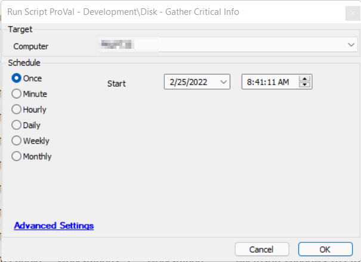

## Summary

Automate Script designed to handle the Agnostic Script [EPM - Disk - Agnostic - Get-CriticalDiskInfo](<../../powershell/Get-CriticalDiskInfo.md>).  
Creates a custom table called `plugin_proval_cdi_data`.  
Appends data from the agnostic script to the created table.

## Sample Run

## Dependencies

- [EPM - Disk - Agnostic - Get-CriticalDiskInfo](<../../powershell/Get-CriticalDiskInfo.md>)  
- [CWM - Automate - Dataview - Disk - Critical Data](https://proval.itglue.com/DOC-5078775-9374639)

## Process

Reference the Agnostic Script Process found in [EPM - Disk - Agnostic - Get-CriticalDiskInfo](<../../powershell/Get-CriticalDiskInfo.md>).

## Output

The location and method by which this script returns data:

- Script log
- Script state
- Local file on computer
- Dataview
