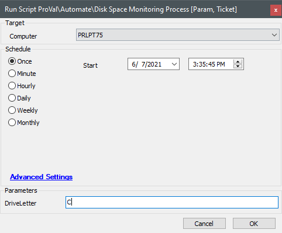

## Summary

This script checks the disk space against thresholds defined in the Properties of an Automate instance, runs a disk cleanup, and creates a ticket if necessary.

[How to Add/Edit System Properties in ConnectWise Automate](https://proval.itglue.com/DOC-5078775-7604247)

Disk cleanup will only run against Windows machines. When executed as an auto-fix from a monitor, the monitor should pass the single drive letter (e.g., C) into the `@fieldname@` variable.

## Sample Run

## Dependencies

N/A

#### User Parameters

| Name        | Example | Required                           | Description                                                  |
|-------------|---------|------------------------------------|--------------------------------------------------------------|
| DriveLetter | C       | True (False when running via a monitor) | The drive letter that should have its drive space checked.   |

#### System Properties

| Name                       | Example           | Required              | Description                                                                                                         |
|----------------------------|-------------------|-----------------------|---------------------------------------------------------------------------------------------------------------------|
| proval_DiskThreshold16-100 | 10 (means 10%)    | True (auto-generated) | The **percentage** threshold for disk space on drives that are greater than or equal to 16GB and less than 100GB. |
| proval_DiskThreshold100-1024 | 25 (means 25GB)  | True (auto-generated) | The **gigabyte** threshold for disk space on drives that are greater than or equal to 100GB and less than 1TB.    |
| proval_DiskThreshold1024+  | 100 (means 100GB) | True (auto-generated) | The **gigabyte** threshold for disk space on drives that are greater than or equal to 1TB.                         |
| proval_DiskTicketCategory   | 102               | True                  | The ticket category under which to create tickets.                                                                 |

#### Script States

| Name                     | Example   | Description                                                                                     |
|--------------------------|-----------|-------------------------------------------------------------------------------------------------|
| TicketNumber `@DriveLetter@` | 123456    | A dynamically named state holding the ticket number for the target ComputerID and Drive.      |

## Process

The following steps are performed:

1. Determine if the context of the script run was from a monitor or not, and set the `@driveletter@` variable as necessary.
2. Create the threshold Properties if they do not exist, and set the variables `@threshold16-100@`, `@threshold100-1024@`, and `@threshold1024+@` from the content of the Properties.
3. Using the script state `TicketNumber@DriveLetter@`, determine if the script has been run against this machine previously and if a ticket has already been created. If there is an existing ticket that is currently open, jump to the `:TicketOpen` label. Otherwise, start the initial check of the drive. (Note: The `:TicketOpen` label follows the same process as step 5, but comments on the existing ticket or closes it if the threshold is not exceeded.)
4. Gather information about the total size of the drive and the current free space. If `@driveletter@` is the system drive (`@windowsdirectory@ == @driveletter@:/Windows`), then the subscript `Windows Disk Cleanup` will be run.
5. Check if the current disk space (after cleanup) is below the threshold for the respective drive size. If so, a PowerShell script will fetch information on the largest 25 files, user profiles, and folders, then comment on the ticket. If the space is not below the threshold, the script will exit.

## Output

- Script Log
- Ticket

