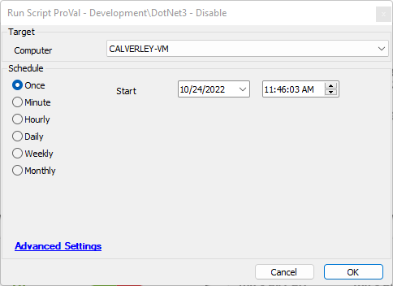

## Summary

This is an automate implementation of the Disable-DotNet3 agnostic script.

## Sample Run

## Dependencies

- [EPM - Windows Configuration - Agnostic - Disable-DotNet3](<../../powershell/Disable-DotNet3.md>)

## Process

Please review agnostic content documentation for process information.

