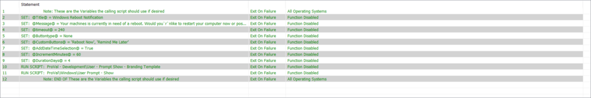
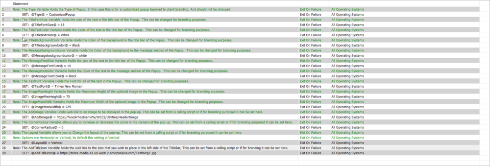

## Summary

This Automate Script is intended to set branding standards for a client. Its only intended purpose is to set variables to be used for calling the User Prompt - Show script and provide a standard branded messaging theme for clients.

## Sample Run

This Script is a Branding Script for the User Prompt - Show script and should never be run manually; it should only be called from other scripts and before running the proval/Windows/User Prompt - Show script. Running this script manually will result in nothing happening at all. It simply sets variables to the desired values. To use this script, copy and paste the lines in the Else section of this script into the desired script, enable the desired functions and set their values, and enable the two run script lines.

## Dependencies

This should be a list of ITGlue documents listed in the Related Items sidebar on which this script depends.

- [EPM - Agnostic - Prompt-User](https://proval.itglue.com/DOC-5078775-9580402)
- [Guide - Prompt-User.Ps1](https://proval.itglue.com/DOC-5078775-9580488)
- [EPM - Data Collection - Script - User Prompt - Show](https://proval.itglue.com/DOC-5078775-9739032)

## Variables

Document the various variables in the script. Delete any section that is not relevant to your script.

| Name                | Description                                                                                                                                          |
|---------------------|------------------------------------------------------------------------------------------------------------------------------------------------------|
| Type                | The Type Variable holds the type of popup; in this case, this is for a customized popup tailored to client branding and should not be changed.     |
| TitleFontSize       | The TitleFontSize Variable holds the size of the text in the title bar of the Popup. This can be changed for branding purposes.                     |
| TitletextColor      | The TitleTextColor Variable holds the color of the text in the title bar of the Popup. This can be changed for branding purposes.                    |
| TitleBackgroundcolor | The TitleBackgroundColor Variable holds the color of the background in the title bar of the Popup. This can be changed for branding purposes.        |
| Messagebackgroundcolor| The MessageBackgroundcolor Variable holds the color of the background in the message section of the Popup. This can be changed for branding purposes.|
| MessageFontSize     | The MessageFontSize Variable holds the size of the text in the message section of the Popup. This can be changed for branding purposes.               |
| MessageTextColor    | The MessageTextColor Variable holds the color of the text in the message section of the Popup. This can be changed for branding purposes.            |
| TextFont            | The TextFont Variable holds the font for all of the text in the Popup. This can be changed for branding purposes.                                   |
| ImageMaxHeight      | The ImageMaxHeight Variable holds the maximum height of the optional image in the Popup. This can be changed for branding purposes.                  |
| ImageMaxWidth       | The ImageMaxWidth Variable holds the maximum width of the optional image in the Popup. This can be changed for branding purposes.                    |
| AddImage            | The AddImage Variable holds a web link to an image to be displayed in the pop-up. This can be set from a calling script or if for branding purposes, it can be set here. |
| CornerRadius        | The CornerRadius Variable allows you to increase or decrease the curve in the corners of the pop-up. This can be set from a calling script or if for branding purposes, it can be set here. |
| Layout              | The Layout Variable allows you to change the layout of the pop-up. This can be set from a calling script or if for branding purposes, it can be set here. |
| AddTitleIcon        | The AddTitleIcon Variable holds the web link to the icon that you wish to place on the left side of the TitleBar. This can be set from a calling script or if for branding purposes, it can be set here. |

These descriptions are present in the script for ease of use:

## Process

This script simply assigns values to variables for use in the User Prompt - Show Script.

## Output

This script outputs standard variable settings to the calling script to be used by User Prompt - Show to produce a standard branded pop-up theme.

