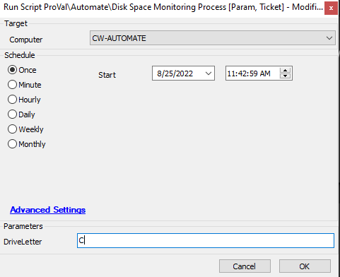

## Summary

This script will check the disk space against thresholds defined in the Properties of an Automate instance, run a disk cleanup, and create a ticket if necessary.

[How to Add/Edit System Properties in ConnectWise Automate](https://proval.itglue.com/DOC-5078775-7604247)

Disk cleanup will only run against Windows machines. When run as an auto-fix from a monitor, the monitor should be passing in the single drive letter (example: C) into the `@fieldname@` variable.

## Sample Run

## Dependencies

[Agent - Drive Space Check - Client Specific](https://proval.itglue.com/DOC-5078775-10731915)

#### User Parameters

| Name        | Example | Required                              | Description                                             |
|-------------|---------|---------------------------------------|---------------------------------------------------------|
| DriveLetter | C       | True (False when running via a monitor) | The drive letter that should have its drive space checked. |

#### System Properties

| Name                      | Example          | Required             | Description                                                                                               |
|---------------------------|------------------|----------------------|-----------------------------------------------------------------------------------------------------------|
| proval_DiskThreshold16-300 | 10 (means 10%)   | True (auto-generated) | The **percentage** threshold for disk space on drives that are greater than or equal to 16GB and less than 300GB. |
| proval_DiskThreshold300-1024 | 30 (means 25GB) | True (auto-generated) | The **gigabyte** threshold for disk space on drives that are greater than or equal to 300GB and less than 1TB. |
| proval_DiskThreshold1024+ | 100 (means 100GB) | True (auto-generated) | The **gigabyte** threshold for disk space on drives that are greater than or equal to 1TB.                 |
| proval_DiskTicketCategory  | 102              | True                 | The ticket category to create tickets under.                                                              |

#### Script States

| Name                     | Example  | Description                                                                                      |
|--------------------------|----------|--------------------------------------------------------------------------------------------------|
| TicketNumber`@DriveLetter@` | 123456   | A dynamically named state holding the ticket number for the target ComputerID and Drive.       |

## Process

The following steps are performed:

1. Determine if the context of the script run was from a monitor or not, and set the `@driveletter@` variable as necessary.
2. Creates the threshold Properties if they do not exist, and sets the variables `@threshold16-300@`, `@threshold300-1024@`, and `@threshold1024+@` from the content of the Properties.
3. Using the script state `TicketNumber@DriveLetter@`, determines if the script has been run against this machine previously and already created a ticket. If there is an existing ticket, and it is currently open, jumps to the `:TicketOpen` label. Otherwise, starts the initial check of the drive. (Note: The `:TicketOpen` label follows the same process as step 5, but instead comments on the existing ticket or closes it if the threshold is not exceeded.)
4. Gathers information about the total size of the drive and the current free space of the drive. If `@driveletter@` is the system drive (`@windowsdirectory@ == @driveletter@:/Windows`), then the subscript `Windows Disk Cleanup` will be run.
5. Checks if the current disk space (after cleanup) is below the threshold for the respective drive size. If so, a report of the largest file sizes for the drive will be generated and a ticket created with the report attached. If the space is not below the threshold, then the script will exit.

## Output

The script logs all messages to the script log.

