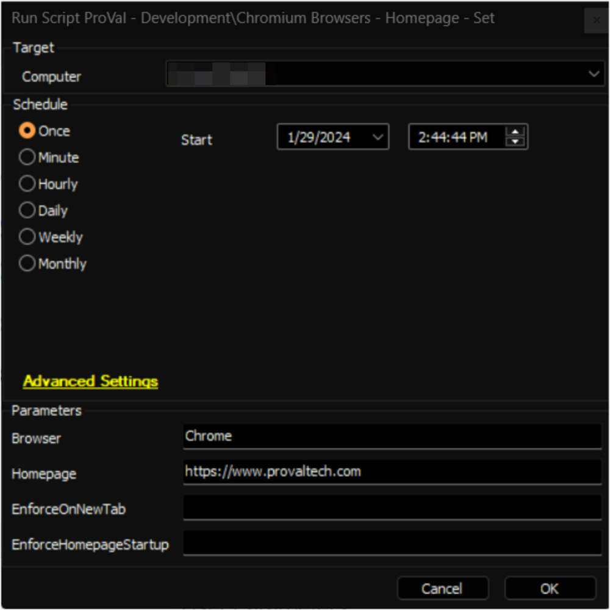
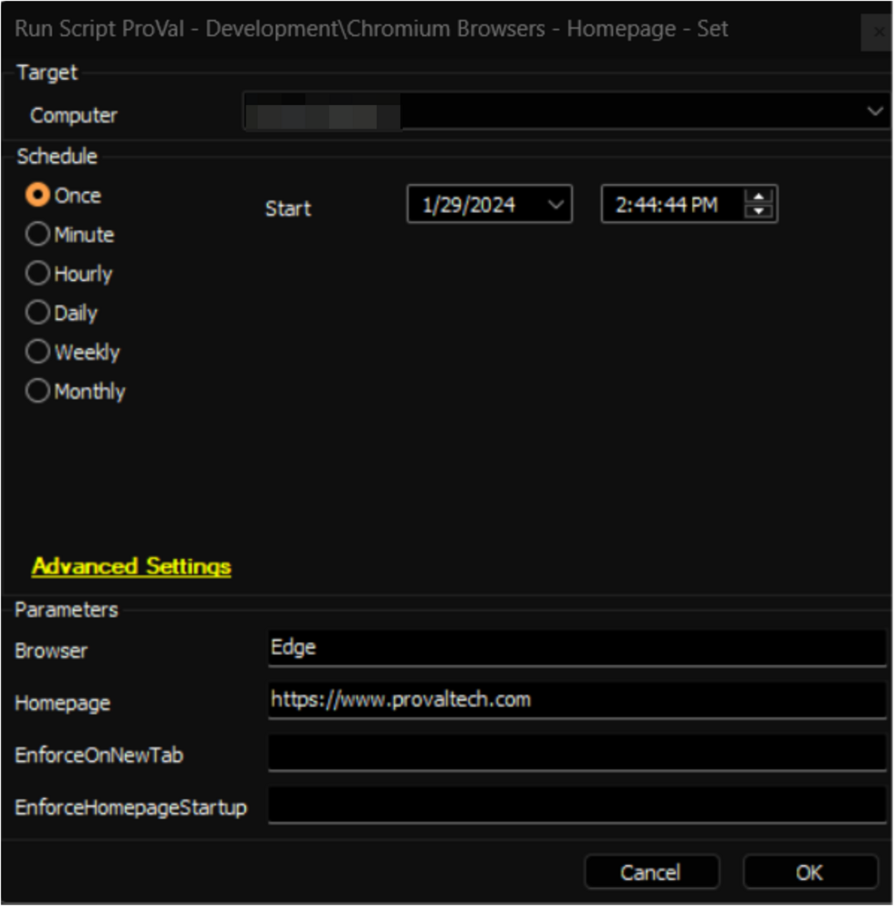

## Summary

It is an Automate implementation of the agnostic script [SWM - Software Configuration - Set-ChromiumHomepage](https://proval.itglue.com/DOC-5078775-10372109) to enforce a home page for the Chromium Browsers. Supported Browsers are `Google Chrome`, and `Microsoft Edge`. 

The `Browser` parameter can be used to specify the browser's name.

## Sample Run

- Setting [https://www.provaltech.com](https://www.provaltech.com) to Google Chrome's homepage:  
  

- Setting [https://www.provaltech.com](https://www.provaltech.com) to Google Chrome's homepage:  
  

- Setting [https://www.provaltech.com](https://www.provaltech.com) to both Microsoft Edge's and Google Chrome's homepage:  
  

## Dependencies

[SWM - Software Configuration - Set-ChromiumHomepage](https://proval.itglue.com/DOC-5078775-10372109)

#### User Parameters

| Name                     | Example                                               | Required | Description                                                                                                      |
|--------------------------|-------------------------------------------------------|----------|------------------------------------------------------------------------------------------------------------------|
| Browser                  | Chrome                                                | False    | The 'Browser' parameter specifies the browser for setting the homepage. Only 'Chrome' and 'Edge' are acceptable values. If this parameter is left blank, the script will attempt to set the homepage for both Chrome and Edge browsers. |
| Homepage                 | [https://www.provaltech.com/](https://www.provaltech.com/) | True     | String value of the homepage to set in the browser.                                                             |
| EnforceOnNewTab         | 1                                                     | False    | Set to 1 to force the homepage on each new tab instead of the new tab page.                                    |
| EnforceHomepageStartup   | 1                                                     | False    | Set to 1 to force the homepage to be the only open tab at startup of the browser.                               |

## Output

- Script Logs

