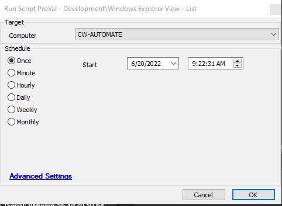

## Summary

This script will set the Windows explorer view to List View.

## Sample Run

## Variables

| Name            | Description                                                                 |
|-----------------|-----------------------------------------------------------------------------|
| RemovalBagMRU   | This includes info on Remove of HKCU bagmru key                            |
| RemovalBags     | This includes info on Remove of HKCU bags key                               |
| ListView        | This includes the list value setting at the HKLM system level for all Windows explorer. |
| OutCome         | Output of the PowerShell script performing the changes.                    |

## Process

This script performs below action:
- HKCU:/Software/Classes/Local Settings/Software/Microsoft/Windows/Shell/BagMRU for all users.
- HKCU:/Software/Classes/Local Settings/Software/Microsoft/Windows/Shell/Bags
  - It creates 'Mode' -Value 3 and 'LogicalViewMode' -Value 4 at the HKLM:/SOFTWARE/Microsoft/Windows/Shell/Bags/AllFolders/Shell/SOFTWARE/Microsoft/Windows/CurrentVersion/Explorer/FolderTypes/TopView, then guid.

## Output

- Script log

