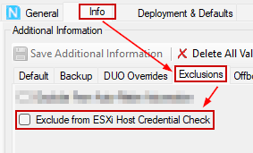
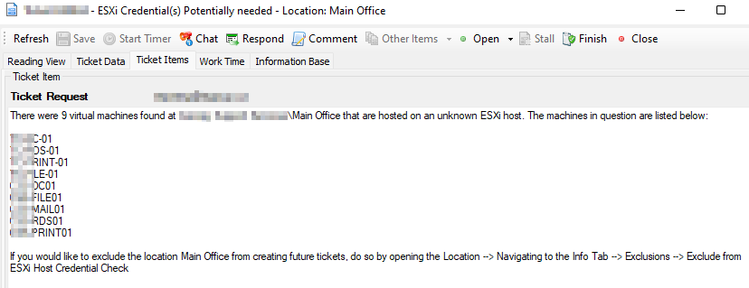
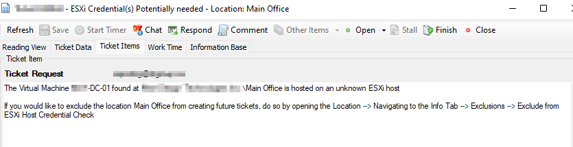

## Summary

This script will create a client ticket for any location in which a virtual machine exists, and no host is present in the virtualization manager plugin.

To exclude any location from this check, please set this checkbox to checked.

## Sample Run

This script should be a scheduled client script; it should be run at regular intervals depending on the client's request for monitoring.

## Variables

Document the various variables in the script. Delete any section that is not relevant to your script.

| Name        | Description                                                                                     |
|-------------|-------------------------------------------------------------------------------------------------|
| sqldataset  | The returned dataset of all locations with computers that do not have a corresponding host in the virtualization manager. |
| Count       | The number of rows that sqldataset has found.                                                 |

## Process

1. Search the database for virtual machines that do not have a known host and return the objects.
2. Loop through all the rows of data returned, creating a ticket for each client—one ticket per location with all found objects noted in the ticket.

## Ticketing

