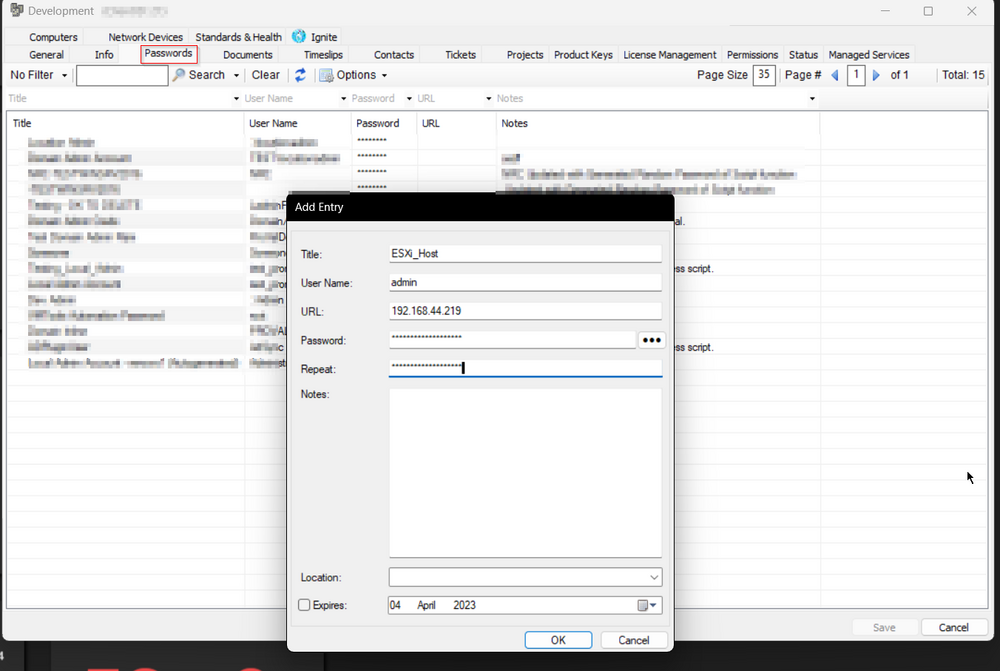
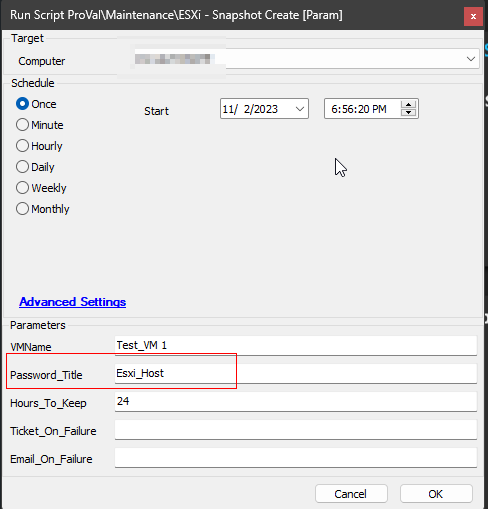
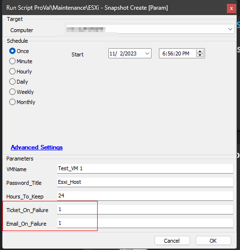

## Summary

This script can be used to create a snapshot of a machine hosted on an ESXi host server. It utilizes the [PowerCLI Module](https://www.powershellgallery.com/packages/VMware.PowerCLI/12.0.0.15947286) to perform the required action.

```
Snapshot Name: SELECT CONCAT('CW-Automate-Temp-Snapshot_', DATE_FORMAT(NOW(), '%Y%m%d_%H%i%s'))
```

```
Example:  CW-Automate-Temp-Snapshot_20230501_081958
```

### Notes

- The script must be executed from a machine that is reachable to the ESXi Host.
- [CWM - Automate - ESXi - Snapshot Delete [Param]](<./CWM - Automate - ESXi - Snapshot Delete Param.md>) will be called to remove the generated snapshot after the hours specified in the `@Hours_To_Keep@` user parameter. The schedule depends on the computer's status in Automate. For example, if `@Hours_To_Keep@` is set to 24, then Automate will schedule the deletion script to run on the same machine after 24 hours. However, the deletion script will not work if the machine is offline after that period.
- It is suggested to execute the script against servers that are mostly online.

## Prerequisites

- .NET Framework 4.7.2+ (Release: 461808)
- PowerShell v5.1+

## Sample Run

- Create a credential entry on the client's password tab to connect with the ESXi Host. It must be an admin/root-level credential.
- Add either the public or private IP address of the ESXi Host in the URL section of the entry. Do not use HTTP or HTTPS along with the IP address.  
  e.g.,  
  ```
  http://10.0.0.4/io ==> Incorrect  
  10.0.0.4 ==> Correct
  ```
- Sample Screenshot:  
  
- Add proper parameters while executing the script.  
    
  The `Password_Title` should be the title of the password entry created in the first step. In the above example, the script will attempt to create a snapshot for the virtual machine `Test_VM 1` and will attempt to remove that snapshot after 24 hours. It will not generate any alerts on failure.
- For alerting on failure:  
    
  In this example, the script will attempt to create a snapshot for the virtual machine `Test_VM 1` and will attempt to remove that snapshot after 24 hours. Additionally, the script will create a ticket if it fails to deliver the desired results and will send a failure email to the user running/scheduling the script. Either or both of the alerting options can be used.

## Dependencies

[CWM - Automate - ESXi - Snapshot Delete [Param]](<./CWM - Automate - ESXi - Snapshot Delete Param.md>)

## Variables

| Name              | Description                                                        |
|-------------------|--------------------------------------------------------------------|
| ProjectName       | ESXi_Snapshot                                                      |
| WorkingDirectory   | C:/ProgramData/_automation/script/ESXi_Snapshot                   |
| ESXiHost          | IP Address of ESXi Host, fetched from the password entry           |
| UserName          | Username to use to connect with the ESXi Host, fetched from the password entry |
| Password          | Password to use to connect with the ESXi Host, fetched from the password entry |
| psout             | Output of the PowerShell script creating the Snapshot              |
| SnapshotName      | Name of the Snapshot to create                                      |

### User Parameters

| Name              | Example        | Required | Description                                                      |
|-------------------|----------------|----------|------------------------------------------------------------------|
| VMName            | WIN-10-TEST1   | True     | The name of the virtual machine to create a snapshot of.        |
| Password_Title    | ESXi_Host      | True     | Title of the password entry to use to connect with the ESXi Host |
| Hours_To_Keep     | 24             | True     | Number of hours to keep the generated snapshot. Leaving it blank or passing 0 will not initiate the removal. |
| Ticket_On_Failure | 1              | False    | 1 to enable ticketing for the script's failure.                 |
| Email_On_Failure  | 1              | False    | 1 to enable email alert for the script's failure. The email will be sent to the user running/scheduling the script. |

## Output

- Script Logs

```
Sample Output:

Name                           Port  User                          
----                           ----  ----                          
10.0.0.25                   443   admin
WARNING: The 'Quiesced' property of Snapshot type is deprecated and will be removed in a future release.
WARNING: The 'Parent' property of Snapshot type is deprecated. Use the 'ParentSnapshot' property instead.

Description       : Snapshot created by PowerShell script
Created           : 2023-04-04 3:36:10 AM
Quiesced          : False
PowerState        : PoweredOff
VM                : DEV-WIN10TEST
VMId              : VirtualMachine-138
Parent            : 
ParentSnapshotId  : 
ParentSnapshot    : 
Children          : 
SizeMB            : 23.03101253509521484375
SizeGB            : 0.0224912231788039207458496094
IsCurrent         : True
IsReplaySupported : False
ExtensionData     : VMware.Vim.VirtualMachineSnapshotTree
Id                : VirtualMachineSnapshot-138-snapshot-1
Name              : CW-Automate-Temp-Snapshot_20230404_033857
Uid               : /VIServer=root@10.0.0.25:443/Snapshot=VirtualMachineSnapshot-138-snapshot-1/

Snapshot created successfully for virtual machine 'DEV-WIN10TEST'
```

- Ticket (If Enabled)
- Email to the user running the script (if Enabled)

## Alerting

**Subject:**  `Snapshot creation failed for the VM @VMName@`

**Body:**

**For Prerequisites Validation Failure:**  
```
Automate failed to create a snapshot for the virtual machine @VMName@.
The prerequisite check failed for %ComputerName% and the `ESXi - SnapShot Create [Param]` script cannot be executed against %ComputerName%. 
Please execute the script against another machine in the network to create the snapshot. 
Prerequisite Validation Command Output: %ShellResult%
```

**For Snapshot Creation Failure:**  
```
Automate failed to create a snapshot for the virtual machine @VMName@. Please review manually. 
PowerShell script result: @psout@
```
