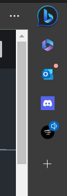
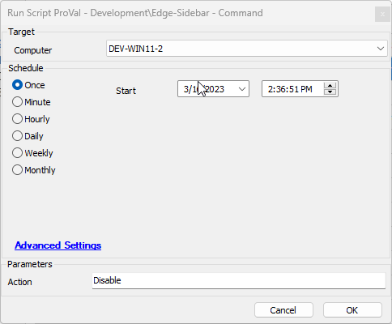
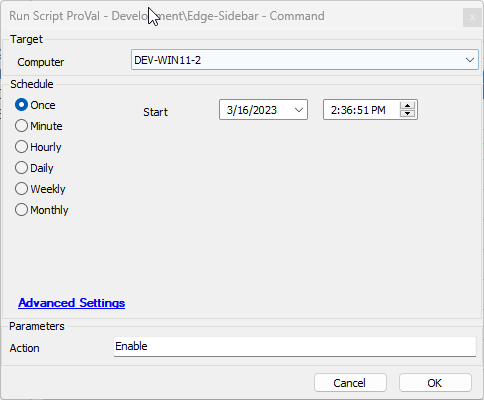
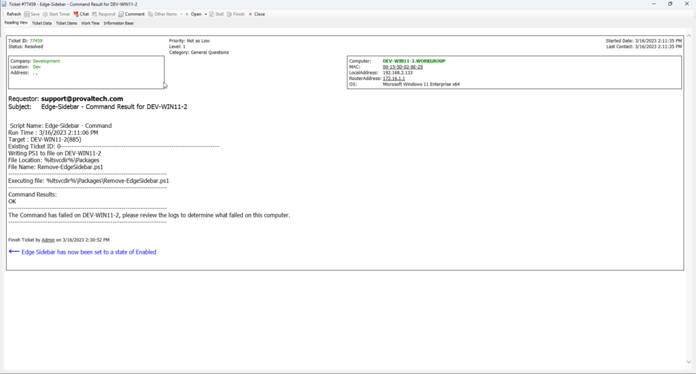

## Summary

Enable or disable the Edge Sidebar on a target machine.



## Sample Run

If no action is passed, then `Disable` will be selected by default.





## Variables

| Name               | Description                                                                 |
|--------------------|-----------------------------------------------------------------------------|
| TickID             | The ID of any current ticket for this script.                              |
| VarLog             | A running log of script actions and results.                               |
| Resolved           | Variable to determine if an issue is resolved for automated ticket completion. |
| TicketFinishbody   | The body to use for a finished or resolved ticket.                         |
| TicketBody         | The body to use for a newly opened or updated ticket.                      |

### Global Parameters

| Name                     | Example                                        | Required | Description                                                                                          |
|--------------------------|------------------------------------------------|----------|------------------------------------------------------------------------------------------------------|
| ProjectName              | Control-EdgeSidebar                           | True     | Designates the name of the created ps1 file to be called by the script.                            |
| ExpectedReturn           | Hive: HKEY_LOCAL_MACHINE/Software/Policies/Microsoft | True     | Designates the expected return of the ps1 file.                                                    |
| TicketCreateSubject      | Edge-Sidebar - Command Result for %ComputerName% | True     | Designates the desired subject line for a ticket created by this script.                            |
| TicketCreationCategory    | 1                                            | True     | Designates the desired ticket creation category for a ticket created by this script.                |
| TicketFinishUserID      | 1                                            | True     | Designates the desired userId for finishing or commenting on a ticket created by this script.      |
| DoNotCommentOpenTicket   | 0 or 1                                      | True     | Toggles commenting on open tickets for recurrent failures.                                          |

### User Parameters

| Name    | Example | Required | Description                                                                                     |
|---------|---------|----------|-------------------------------------------------------------------------------------------------|
| Action  | Enable  | False    | Defaults to `Disable`. `Disable` disables the sidebar. `Enable` enables the sidebar.          |

## Output

- Script log
- Ticket

## Example Script Log

```
Script Name: Edge-Sidebar - Command
Run Time : 3/16/2023 2:30:14 PM
Target : DEV-WIN11-2(885)
Existing Ticket ID: 77459
-------------------------------------------------------------------------
Writing PS1 to file on DEV-WIN11-2 
File Location: %ltsvcdir%/Packages
File Name: Remove-EdgeSidebar.ps1
-------------------------------------------------------------------------
Executing file: %ltsvcdir%/Packages/Remove-EdgeSidebar.ps1
-------------------------------------------------------------------------
Command Results: 
OK
-------------------------------------------------------------------------
The Command has completed successfully,
A reboot / logoff / logon is required for the setting to completely apply to the computer.
-------------------------------------------------------------------------
A ticket already exists for DEV-WIN11-2
TicketId is: 77459
-------------------------------------------------------------------------
Resolution is : True
TicketId: 77459
Finishing ticket 77459
-------------------------------------------------------------------------
```

## Ticket Example


