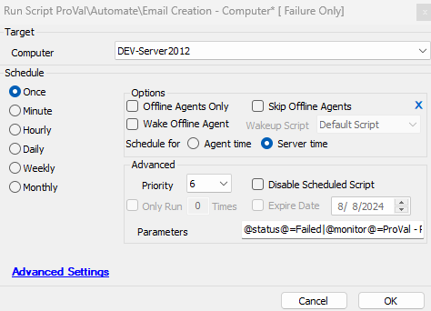

## Summary

This script functions similarly to the [CWM - Automate - Script - Ticket Creation - Computer](https://proval.itglue.com/DOC-5078775-9098338) script; however, instead of creating a ticket, it is designed to send the FAILED outcomes of a RAWSQL monitor to the email address provided in the system property.

This script sends emails to two different addresses:

1. If the script is called by the alert template "**△ Custom - Email RAWSQL Monitor set results to ProVal**", then it will send an email to the email address set at system property "ProVal_Alerts_Email_Address", which is mostly set to "[alerts@provaltech.com](mailto:alerts@provaltech.com)".  
   **Note:** If the property is missing, the script will automatically set it to "[alerts@provaltech.com](mailto:alerts@provaltech.com)", but if it is set to a different email address, then it will not be modified.

2. If the script is called by any other template, then it will fetch the email address from the system property "_sysTicketDefaultEmail".

**Note:** The script is designed to send the failure messages/emails only.

## Sample Run

It's an Autofix script and is attached to the "△ Custom - Email RAWSQL Monitor set results to ProVal" alert template for now.

## System Property

| Name                          | Example                      | Required | Description                                                                                                                                                                                                                               |
|-------------------------------|------------------------------|----------|-------------------------------------------------------------------------------------------------------------------------------------------------------------------------------------------------------------------------------------------|
| _sysTicketDefaultEmail        | [test@test.com](mailto:test@test.com) | Yes      | This email address is used when the script calls from the alert template other than "**△ Custom - Email RAWSQL Monitor set results to ProVal**".                                                                                         |
| ProVal_Alerts_Email_Address    | [alerts@provaltech.com](mailto:alerts@provaltech.com) | Yes      | This email address is used when the script calls from the alert template "**△ Custom - Email RAWSQL Monitor set results to ProVal**". **Note:** It is mandatory to use the [alerts@provaltech.com](mailto:alerts@provaltech.com) with this system property as it is intentionally created for the alerts which are required to be passed on to the ProVal support team from the partner environment. |

## Global Parameter

| Name          | Example | Required | Description                                                                                 |
|---------------|---------|----------|---------------------------------------------------------------------------------------------|
| EmailOnSuccess| 0       | True     | 0 disables emailing a success email. 1 enables emailing a success email.               |

## Variables

| Name          | Description                                                       |
|---------------|-------------------------------------------------------------------|
| FIELDNAME     | Identity Field of the monitor set                                 |
| TicketSubject | Ticket Subject from the alerting tab of the monitor set          |
| SuccessMSG    | Success Message from the alerting tab of the monitor set         |
| FailedMSG     | Failure Message from the alerting tab of the monitor set         |
| Status        | FAILED/SUCCESS status of the monitor set                          |
| Email         | Email address of the contact/user used in the alert template     |
| Dataout       | Monitor set's statement                                           |
| Dataoutlength | Position of the last parentheses in the Monitor set's query, this is calculated in order to get rid of (select computerid from tcomp) from the monitor set's statement. Keeping this statement will lead to the script's failure. |
| Monitor       | Name of the monitor set                                           |

## Process

1. Check the Status of the monitor set and not act for Success.
2. For the failures, it will proceed.
3. Stores the SQL query used in the monitor set to [the @Dataout@](the%C2%A0@Dataout@) variable. Also, it replaces the 'from tcomp' with 'from computers', if it exists in the SQL query. To perform this replacement, it converts the whole query to lowercase.
4. Find the @FieldName@, [@TicketSubject@,@SuccessMSZ@](http://@TicketSubject@,@SuccessMSZ@), [@FailedMSZ@](http://@FailedMSZ@), and @Email@.
5. Email the outcome to the email address of the user/contact of the alert template.

## Output

Email

