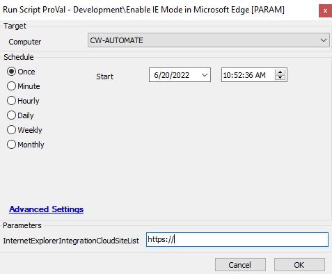

## Summary

This script enables the IE mode for a particular site.  
Please provide the variable `InternetExplorerIntegrationCloudSiteList` in the PowerShell to allow the other sites to open in IE mode inside the Edge.

## Sample Run

## Variables

| Name                          | Description                                               |
|-------------------------------|-----------------------------------------------------------|
| Enabled IE Mode in Edge      | Computer EDF - Checked when IE Mode set in Edge          |

#### User Parameters

| Name                          | Example    | Required | Description                                           |
|-------------------------------|------------|----------|-------------------------------------------------------|
| InternetExplorerIntegrationCloudSiteList | https://   | True     | The site link which requires to open in Edge in IE Mode |

## Process

This script enables the IE mode for a particular site.  
Please provide the variable `InternetExplorerIntegrationCloudSiteList` in the PowerShell to allow the other sites to open in IE mode inside the Edge.  
Once the setting is done it checks the computer EDFs for the logging in the database.

## Output

- Script log

