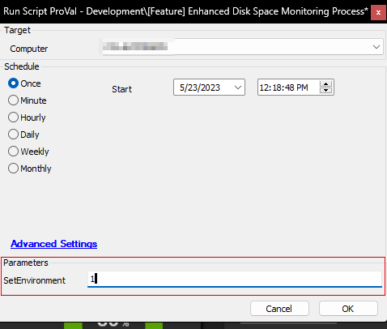
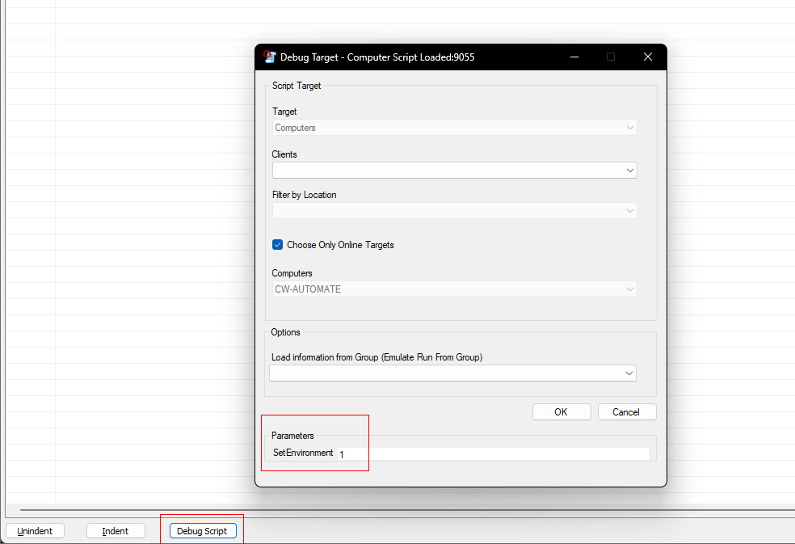
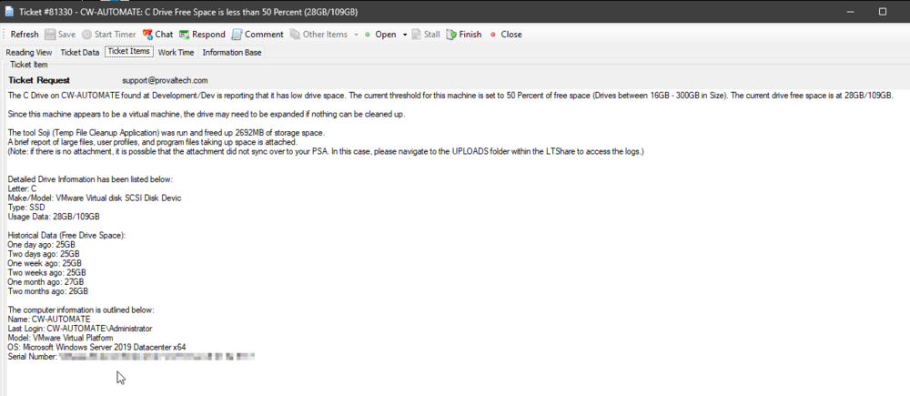
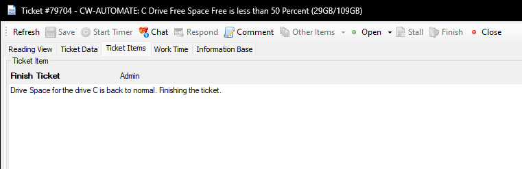

## Summary

The script serves as an autofix for the [EPM - Disk - Internal Monitor - ProVal - Production - Agent - Enhanced Drive Space Monitor](https://proval.itglue.com/DOC-5078775-12182106). Here are the key points and functionality of this autofix script:

1. **Monitoring Drive Space:**
   - The monitor set detects machines where the drive space is lower than the Upper Threshold.
   - The script keeps monitoring the machine until the drive space goes below the Lower Threshold.

2. **Disk Cleanup and Ticket Creation:**
   - The script continues to reschedule itself for the specific computer until the drive space falls below the Lower Threshold (Threshold).
   - Once the drive space falls below the Lower Threshold, the script executes a disk cleanup process.
   - If necessary, the script creates a ticket to alert administrators or responsible parties about the low drive space condition.

3. **Maximum Offline Duration:**
   - The script includes a mechanism to handle machines that remain offline for an extended period.
   - If a machine is consecutively offline for 72 hours, the script schedules itself for a maximum of 72 hours against that machine.
   - This ensures that the autofix script remains active and ready to address the drive space issue once the machine comes online.

4. **Ticket Closure:**
   - Once the free drive space grows larger than the respective Upper Threshold (Threshold + Variance), the script closes the associated ticket.
   - This allows the monitoring system to avoid continuously creating and closing tickets when the drive space fluctuates around the threshold.

**Note:**
- Detailed information about Threshold, Variance, EDFs (Extra Data Fields), and System Properties can be found in the documentation or specifications of the [monitor set](https://proval.itglue.com/DOC-5078775-12182106).
- These parameters and configurations provide flexibility for customizing the monitoring behavior and adapting it to specific environments and requirements.

## Sample Run

The script is designed to run from the [EPM - Disk - Internal Monitor - ProVal - Production - Agent - Enhanced Drive Space Monitor](https://proval.itglue.com/DOC-5078775-12182106) monitor set only and should not be executed manually against any machine except for the first time to set the environment.

After importing the script it should either be debugged or run against any computer in the environment with 1 in the user parameter `SetEnvironment`.





## Dependencies

- [EPM - Disk - Internal Monitor - ProVal - Production - Agent - Enhanced Drive Space Monitor](https://proval.itglue.com/DOC-5078775-12182106)
- [EPM - Disk - Automate - Script - Soji - Disk Space Management](https://proval.itglue.com/DOC-5078775-11073740)

## Variables

| Name                | Description                                                                                                          |
|---------------------|----------------------------------------------------------------------------------------------------------------------|
| STATUS              | Status returned by the [EPM - Disk - Internal Monitor - ProVal - Production - Agent - Enhanced Drive Space Monitor](https://proval.itglue.com/DOC-5078775-12182106) monitor set. (Success/Failure) |
| DriveLetter         | Drive Letter returned by the monitor set.                                                                           |
| DriveSize           | Size of the concerned drive in MB.                                                                                 |
| InitialFree         | Free drive space in MB before performing the disk cleanup.                                                         |
| sojicomment         | Result returned by the [EPM - Disk - Automate - Script - Soji - Disk Space Management](https://proval.itglue.com/DOC-5078775-11073740) script. |
| finishstatus        | Finish Status returned by the [EPM - Disk - Automate - Script - Soji - Disk Space Management](https://proval.itglue.com/DOC-5078775-11073740) script. (True/False) |
| SojiFailureComment   | Failures returned by the [EPM - Disk - Automate - Script - Soji - Disk Space Management](https://proval.itglue.com/DOC-5078775-11073740) script if any. |
| nowfree             | Free drive space in MB after performing the disk cleanup.                                                          |
| freed               | Amount of drive space in MB freed after performing the disk cleanup.                                               |
| TicketCreationCategory | Ticket Category ID for the ticket to create.                                                                      |
| TicketVariable      | Stores the ExistingTicketid, TicketSubject, and TicketBody Variable for the concerned drive.                       |
| ExistingTicketID    | TicketID of the existing ticket.                                                                                    |
| TicketSubject       | Subject of the ticket to create.                                                                                    |
| TicketBody          | Ticket Summary or comment to add to the ticket.                                                                    |
| Reschedule          | Script sets this variable to 1 while rescheduling itself so that it can be checked whether it's the first run or not at the next execution. |
| OfflineExecutions    | Stores the number of times the script had executed consecutively for the computer when it's offline.                |
| Monitorid           | ID of the [EPM - Disk - Internal Monitor - ProVal - Production - Agent - Enhanced Drive Space Monitor](https://proval.itglue.com/DOC-5078775-12182106) monitor set to set to the ticket. |

### Global Parameters

| Name                          | Default | Required | Description                                                                                                                                                                                                                                     |
|-------------------------------|---------|----------|-------------------------------------------------------------------------------------------------------------------------------------------------------------------------------------------------------------------------------------------------|
| ServerTicketCreationCategory  | 0       | False    | Setting to a predefined ticket creation category will set a specified ticket creation category for server-type devices. Setting the ticket category in the script will override the ticket category set either at group or computer levels. The ticket category settings are defined properly in the [monitor set's](https://proval.itglue.com/DOC-5078775-12182106) document. 0 in the value represents that this global property is not in use. |
| WorkstationTicketCreationCategory | 0       | False    | Setting to a predefined ticket creation category will set a specified ticket creation category for workstation-type devices. Setting the ticket category in the script will override the ticket category set either at group or computer levels. The ticket category settings are defined properly in the [monitor set's](https://proval.itglue.com/DOC-5078775-12182106) document. 0 in the value represents that this global property is not in use. |

### User Parameters

| Name            | Example | Required                  | Description                                                                                                                                       |
|-----------------|---------|---------------------------|---------------------------------------------------------------------------------------------------------------------------------------------------|
| SetEnvironment   | 1       | True for first run only   | Set it to 1 for the first run after importing the script. This will create the EDFs and System Properties needed for the solution.              |

### Script States

| Name                        | Example | Description                                                                                   |
|-----------------------------|---------|-----------------------------------------------------------------------------------------------|
| Drive_Space_<ScriptID>_<DriveLetter> | 72198   | Holds a created ticket number and drive letter for a previous ticket if open.               |

## Output

- Script log
- Script state
- Local file on computer
- Ticket
- Soji.zip file in the Uploads folder within the LTShare

## Ticketing

**Subject:** `<ComputerName>: <DriveLetter> Drive Free Space Free is less than <Threshold> (<FreeSpaceGB>/<DriveSizeGB>)`

**Ticket Body:**

```
The <DriveLetter> Drive on <ComputerName> found at <ClientName>/<LocationName> is reporting that it has low drive space. The current threshold for this machine is set to <Threshold> of free space (<Drive Size Range>). The current drive free space is at <FreeSpaceGB>/<DriveSizeGB>.
#The next line will be added for the virtual machines only.
Since this machine appears to be a virtual machine, the drive may need to be expanded if nothing can be cleaned up.
<SojiComment>
Detailed Drive Information has been listed below:
Letter: <DriveLetter>
Make/Model: <DiskModel>
Type: <Disk Type>
Usage Data: <FreeSpaceGB>/<DriveSizeGB>

Historical Data (Free Drive Space):
One day ago: <FreeSpaceGB>
Two days ago: <FreeSpaceGB>
One week ago: <FreeSpaceGB>
Two weeks ago: <FreeSpaceGB>
One month ago: <FreeSpaceGB>
Two months ago: <FreeSpaceGB>

The computer information is outlined below:
Name: <ComputerName>
Last Login: <LastLoggedInUser>
Model: <ComputerMode>
OS: <OperatingSystem>
Serial Number: <SerialNumber>
```

**<SojiComment> can be different and it depends on the results returned by the disk cleanup script [EPM - Disk - Automate - Script - Soji - Disk Space Management](https://proval.itglue.com/DOC-5078775-11073740)**

**For a successful Run of the script:**

```
The tool Soji (Temp File Cleanup Application) was run and freed up @freed@MB of storage space.
A brief report of large files, user profiles, and program files taking up space is attached.
(Note: if there is no attachment, it is possible that the attachment did not sync over to your PSA. In this case, please navigate to the UPLOADS folder within the LTShare to access the logs.)
```

**For Failure of the script:**

```
The tool Soji (Temp File Cleanup Application) was run and failed due to an unexpected error. Please refer to the internal notes to determine the root cause.
```

**Another ticket comment will be added if the [EPM - Disk - Automate - Script - Soji - Disk Space Management](https://proval.itglue.com/DOC-5078775-11073740) script fails:**

```
Script logs from the Soji (Temp File Cleanup Tool) Script:

The installation of .NET on %ComputerName% result was:
<DotNetInstallationResult>
If this contains errors then either the .NET installation package could not be downloaded or was blocked from execution.

The results from Soji's execution were:
<ResultReturnedBytheDiskCleanupToolSoji>
If this contains a 1 then one of the following errors may have occurred:
- Soji could not be downloaded and was not present from a previous run
- Soji was blocked or quarantined

If no errors occurred with Soji, an attempt to compress the log files was made. The result of the attempted compression was:
<ResultsReturnedWhileCompressingTheLogFilesToUploadAndAttachToTheTicket>
If this is an error, then the compressed logs may be unavailable.
```

**Sample Screenshots of Tickets:**






