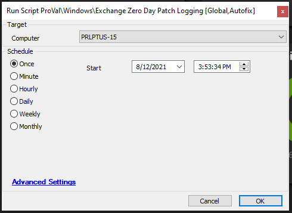

## Summary

This script helps to fetch the vulnerability attack detection for the recent Exchange Zero Day Vulnerability.  
It majorly looks for the CVE:

CVE-2021-26855  
CVE-2021-26858  
CVE-2021-26857  
CVE-2021-27065  

If any of the above vulnerabilities are detected, then it checks whether the patch has been installed or not (KB5000978, KB5000871).  
If the patch is also missing, then you can view the logs in the script log or you can get logs in the ticket which informs that the agent is being attacked but no fix has been applied yet.  

For getting a ticket, you must change the global parameter value for TicketCreation to 1.  

**Time Saved by Automation:** 15 Minutes

## Sample Run

## Dependencies

- Windows Exchange Server
- Intended to be triggered from the following monitor(s):
  - [ProVal - Production - CVE-2021-26858 Detection](https://proval.itglue.com/DOC-5078775-8060253)
  - [ProVal - Production - CVE-2021-26857 Detection](https://proval.itglue.com/DOC-5078775-8027831)
  - [ProVal - Production - CVE-2021-26858 Detection](https://proval.itglue.com/DOC-5078775-8060253)

## Variables

Document the various variables in the script. Delete any section that is not relevant to your script.

### Global Parameters

| Name            | Example | Required | Description                                                                                  |
|-----------------|---------|----------|----------------------------------------------------------------------------------------------|
| TicketCreation   | 0       | True     | If set to '1' will enable Ticket creation, default is 0 to disable ticketing                 |

## Process

Performs various checks of Exchange server logs via PowerShell to confirm what CVEs apply to that server.  
Corrective steps and checks for patch installs are then taken based on CVE results.  

Primarily, the installation of KB5000871 is confirmed for the resolution of CVE-2021-26855, 26858, 27065.

## Output

- Script log
- Ticketing if enabled in Globals

