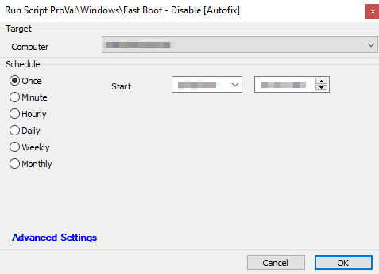

## Summary

This script will adjust the local registry on the target device and will disable the Windows Fast Boot feature. When a machine has Fast Boot enabled, the machine will not perform a full kernel reboot on "shutdown" and can cause systems to misbehave. This can also impact patches installing on devices as the patch will not be able to apply itself fully until the machine is properly restarted. The target device will need to be restarted for this change to take effect.

**Time Saved by Automation:** 5 Minutes

## Sample Run

**Target:** Windows Device  
**Note:** This script is part of the ProVal @Fast Boot Solution. This solution can be run manually and not as an autofix.

## Dependencies

- **Role Definition:** @Windows Fast Boot Enabled
- **Monitor:** @ProVal - Production - Windows - Fast Boot Enabled
- **Dataview:** Windows - @Fast Boot Enabled [Role]

## Variables

- **@HiberBoot@** - This variable is used to verify that the registry change took place as expected.

## Process

This script will first verify that it is a Windows-based device, or it will exit.

It will then set the registry key to Disable Fast Boot on the system and verify that the change occurred as expected.

If the script was successful, it will exit with a log message indicating that the registry was updated successfully and the machine needs to be rebooted for the setting to go into effect.

If the value did not change in the registry, the script will exit as a failure with a log message indicating it was unable to adjust the registry value.

## Output

Script log messages only.

