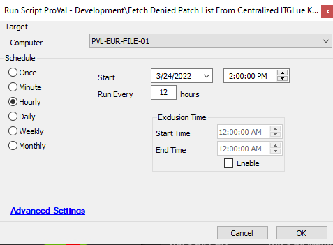

## Summary

This script runs twice per day against our file server "PVL-EUR-FILE-01".  
The script retrieves a list of denied patches from our [Denied Patches](https://proval.itglue.com/5078775/assets/236189-denied-patches/records) Flexible Asset.  
This list is then saved to the URL [DeniedPatchReplace.sql](https://file.provaltech.com/repo/config/DeniedPatchReplace.sql). Additionally, it sends an informational email to [ram.kishor@provaltech.com](mailto:ram.kishor@provaltech.com) and [support@provaltech.com](mailto:support@provaltech.com) in the event of failures.  

**Note:** The script must not be imported to any of our partners.

## Sample Run

## Dependencies

- [Denied Patches](https://proval.itglue.com/5078775/assets/236189-denied-patches/records)
- [DeniedPatchesReplace.sql](https://file.provaltech.com/repo/config/DeniedPatchReplace.sql)  
- PVL-EUR-FILE-01

## Variables

| Name     | Description                                                                                     |
|----------|-------------------------------------------------------------------------------------------------|
| OutFile  | Result of the PowerShell script writing to the E:/repo/config/DeniedPatchReplace.sql file.   |

#### Global Parameters

| Name                    | Example                           | Required | Description                                                  |
|-------------------------|-----------------------------------|----------|--------------------------------------------------------------|
| repoFilePath            | E:/repo/config/DeniedPatchReplace.sql | Yes      | Path to write the file on PVL-EUR-FILE-01                   |
| API_Key                 |                                   | Yes      | API Key to communicate with ITGlue                           |
| ITGlueFlexAssetName     | Denied Patches                    | Yes      | Name of the flexible asset                                    |
| ITGlueOrganizationID     | 5078775                           | Yes      | Organization ID for the organization hosting the Flexible Asset |

## Process

1. Verify if the name of the computer is "PVL-EUR-FILE-01".
2. Execute the PowerShell script to fetch and store the denied patches from the ITGlue Flexible Asset to the E:/repo/config/DeniedPatchReplace.sql file.
3. Run a `Get-Content` command to verify the content of the E:/repo/config/DeniedPatchReplace.sql file.
4. Exit if it finds "REPLACE INTO Plugin_ProVal_Denied_Patches" in the file. Otherwise, send an informational email to [ram.kishor@provaltech.com](mailto:ram.kishor@provaltech.com) and [support@provaltech.com](mailto:support@provaltech.com).

## Output

[DeniedPatchReplace.sql](https://file.provaltech.com/repo/config/DeniedPatchReplace.sql)

For failure:  
- Script log  
- Email  

