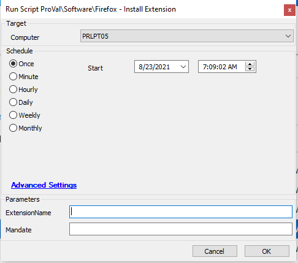

## Summary

This script can be used to install and optionally enforce an extension in Mozilla Firefox.

**Time Saved by Automation:** 5 Minutes

## Sample Run

## Dependencies

- PowerShell v5
- Mozilla Firefox
- [Register-FirefoxExtension](<../../powershell/Register-FirefoxExtension.md>)

## Variables

- `@PS1DataLog@` - Helps to verify if the script actually succeeded.
- `@PS1ErrorLog@` - Helps to track the failure of the script.

#### User Parameters

| Name              | Example   | Required | Description                                                |
|-------------------|-----------|----------|------------------------------------------------------------|
| -ExtensionName    | Grammarly | True     | The name of the extension from the URL to install into Firefox. |
| -Mandate          | 1         | False    | Use this switch to prevent the removal of the target add-on in Firefox. |

## Process

The script first confirms that Firefox is installed in one of two locations:

- `$env:ProgramFiles/Mozilla Firefox`
- `${env:ProgramFiles(x86)}/Mozilla Firefox`

If `firefox.exe` is not found in either location, the script will exit.

The script then makes a call to the Firefox Add-ons API to determine the GUID of the add-on. This will be either a standard GUID format or an email address. If the GUID cannot be parsed, the script will exit.

The script will then create the `$env:ProgramFiles/Mozilla Firefox/distribution` folder if it does not exist.

Next, the script checks if a `policies.json` file already exists in the distribution folder. If it does not, a new file is created with the proper deployment settings based on the parameters, and the script exits. If the file does exist, multiple sub-level checks occur to ensure that no existing data is removed, and the new settings are merged with the existing settings in a new `policies.json` file.

## Output

- Script log
- Local file on the computer

