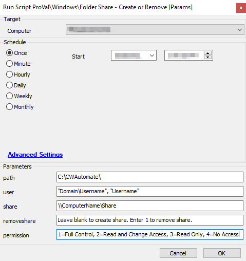

## Summary

This script is built to create or remove shared folders on the target device.

**Time Saved by Automation:** 5 Minutes

## Sample Run

**Target:** Windows Device

Please see the user parameters section below for additional information!

## Dependencies

None

## Variables

- `@PSOUT@` - Used to store results from the first Execute Script function and compare the results in the script.
- `@path@` - The path to the folder that needs to be shared.
- `@share@` - The name of the share.

#### Global Parameters

| Name                     | Example | Required | Description                                                                                     |
|--------------------------|---------|----------|-------------------------------------------------------------------------------------------------|
| ScriptEngineEnableLogger | 1       | False    | Setting this variable to 1 will provide improved logging while the script is running.          |

#### User Parameters

| Name        | Example                       | Required | Description                                                                                                                                                   |
|-------------|-------------------------------|----------|---------------------------------------------------------------------------------------------------------------------------------------------------------------|
| Path        | C:/Labtech/                   | True     | What the parameter represents. Please ensure there is a closing backslash like the example! This is required.                                               |
| User        | "Domain/Username", "Username" | True     | Always wrap the username in double quotes: "username". If the user is a domain user, please include the domain name before the username. This list can be a comma-separated list with a comma and space between the users. See example. |
| Share       | //MachineName/Share           | True     | The name for the folder share.                                                                                                                               |
| RemoveShare | 1                             | False    | If left blank, this script will create the shared folder. If set to 1, the script will attempt to remove the share.                                         |
| Permission  | 1                             | True     | 1=Full Control, 2=Read and Change Access, 3=Read Only, 4=No Access.                                                                                      |

## Process

The script will execute a PowerShell script, passing the above parameters. The script will then check the output of the PowerShell script to determine if the process was successful or failed. On failures, the script will exit with appropriate error messages indicating what caused the failure.

## Output

Script log messages.

