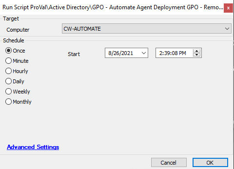

## Summary

This script will remove the "Automate Agent Deployment" group policy from the DC server.

Time Saved by Automation: 10 Minutes

## Sample Run

## Process

Runs the appropriate PowerShell to remove the "Automate Agent Deployment" GPO from the target DC.

## Output

- Script log

