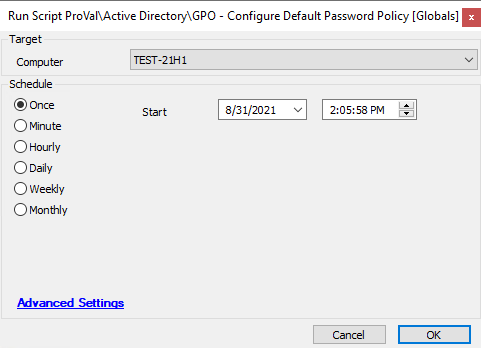

## Summary

The script modifies the properties of the default password policy for a domain. You can modify property values by using the cmdlet parameters and adjusting the values in the global variables.

**Time Saved by Automation:** 15 Minutes

## Sample Run

#### Global Parameters

| Name                        | Example       | Required | Description                                                                                     |
|-----------------------------|---------------|----------|-------------------------------------------------------------------------------------------------|
| LockoutDuration             | 00:30:00      | True     | This helps to lock the machine for the provided time window after multiple failed attempts.    |
| LockoutThreshold            | 5             | True     | This helps to lock the machine after the provided failed attempt count.                        |
| LockoutObservationWindow    | 00:20:00      | True     | This helps to show information about how much time must pass before trying to log in again.   |
| ComplexityEnabled           | 1             | True     | This indicates whether password complexity is enforced, including a combination of numbers, characters, and special conditions as per requirements. |
| ReversibleEncryptionEnabled  | 0             | True     | This indicates whether encryption is enabled or not.                                           |
| MinPasswordLength          | 10            | True     | This specifies the minimum password length.                                                    |
| PasswordHistoryCount       | 10            | True     | This specifies the number of previous passwords that cannot be reused.                         |
| MaxPasswordAge             | 90.00:00:00   | True     | This ensures the password expiration date after a certain threshold is set.                   |
| MinPasswordAge             | 01:00:00      | True     | This ensures the minimum password age.                                                          |

## Process

- This script will first retrieve the domain name.
- The script will run PowerShell to modify the properties of the default password policy for a domain. You can modify property values by adjusting the values in the global variables.

## Output

- Script log

