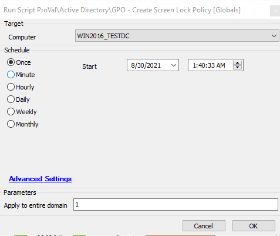

## Summary

This script uses global variables to configure the number of seconds before a screen locks. By default, this script imports with this set at 900 seconds. This setting can be configured in the script's global variables section if your best practices differ from the ones configured in the script.

**Time Saved by Automation:** 5 Minutes

## Sample Run

## Dependencies

The script must be run against the Windows Domain Controllers.

## Variables

| Variable Name     | Description                                                                                       |
|-------------------|---------------------------------------------------------------------------------------------------|
| Timeout-Seconds   | This variable defines the number of seconds before a screen locks. By default, it is set to 900 seconds. |

#### Global Parameters

| Name                          | Example | Required | Description                                                                                   |
|-------------------------------|---------|----------|-----------------------------------------------------------------------------------------------|
| Apply to entire domain        | 1       | True     | This option helps to decide whether it is required to apply to the entire domain or not.     |

## Process

This script uses global variables to configure the number of seconds before a screen locks. By default, this script imports with this set at 900 seconds. This setting can be configured in the script's global variables section if your best practices differ from the ones configured in the script. The script runs two PowerShell scripts to create a GPO based on the parameters set in the script. If the parameter **Apply to entire domain** is null, the GPO will not link to the entire domain, and vice versa.

## Output

- Script log

