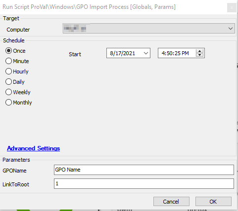

## Summary

Imports a target GPO and optionally links it to the root of the domain.

Time Saved by Automation: 10 Minutes

## Sample Run

## Dependencies

- Target ZIP must be named identical to the GPO to be imported.  
  i.e. If making a backup of the GPO "Enable Auditing", the ZIP file should be named "Enabled [Auditing.zip](http://auditing.zip)".
- Target ZIP file must be placed in the following directory in the LTShare:  
  C:/LTShare/Transfer/GPOs/GPOName.zip
- Target ZIP file must be in the following format:  
  [GPOName.zip](http://gponame.zip)

## Variables

### Global Parameters

| Name    | Example  | Required | Description                                                                                          |
|---------|----------|----------|------------------------------------------------------------------------------------------------------|
| TempDir | C:/temp  | True     | The top-level directory to store files for this process on the target machine. It will be created if it does not exist. |

### User Parameters

| Name       | Example      | Required | Description                                                                                                                                                          |
|------------|--------------|----------|----------------------------------------------------------------------------------------------------------------------------------------------------------------------|
| GPOName    | GPO Name     | True     | The name of the GPO to import and also the base name of the backup zip file to download. You can use the "Available GPOs for Deployment" dataview to see possible options for this parameter. |
| LinkToRoot | 1            | False    | If this is set to 1, then the script will link the created GPO to the root of the domain, otherwise no link will be created.                                       |

## Process

- The script runs a subscript to verify the location credentials. Will exit on error if it cannot verify the credentials.
- Creates the @TempDir@ directory if it does not exist and downloads the ZIP file.
- Executes the PowerShell as the location Admin.
- If the GPO fails to be created or fails to link (if required) then an applicable error will be thrown.

## Output

- Script log

