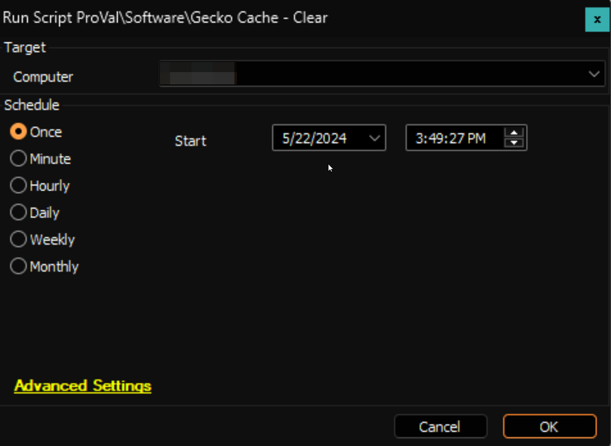

## Summary

This is the Automate implementation of the agnostic script [SWM - Software Configuration - Script - Clear-GeckoCache](https://proval.itglue.com/DOC-5078775-10371997).

## Sample Run

## Output

- Script log

