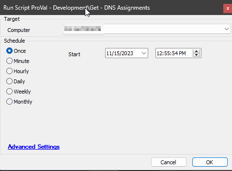

## Summary

The script retrieves details about accessible network adapters from a Windows computer, including their DNS configurations, and then saves the gathered data into a custom table.

## Sample Run

## Variables

| Name            | Description                                                                                     |
|-----------------|-------------------------------------------------------------------------------------------------|
| TableName       | [pvl_network_Adapter](https://proval.itglue.com/5078775/docs/14378279)                       |
| ProjectName     | Get-DNSAssignments                                                                              |
| WorkingDirectory | C:/ProgramData/_Automation/Script/Get-DNSAssignments                                          |
| FilePath        | C:/ProgramData/_Automation/Script/Get-DNSAssignments/Get-DNSAssignments.ps1                   |
| JsonPath        | C:/ProgramData/_Automation/Script/Get-DNSAssignments/Get-DNSAssignments.json                   |

## Output

- Script Log
- Custom Table
- Dataview

