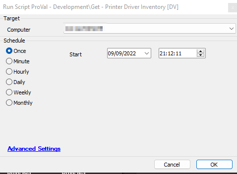

## Summary

This script collects information about the printer drivers on the target system and stores it in the [plugin_proval_Printer_driver](/docs/21b8a07c-6756-415e-93c0-97e7eca8dbae) table.

**Intended Target:** Windows Computers

## Sample Run

## Dependencies

- [CWM - Automate - Custom Table - plugin_proval_Printer_driver](/docs/21b8a07c-6756-415e-93c0-97e7eca8dbae)
- [CWM - Automate - Solution - Get - Printer Driver Inventory](/docs/485b0ab5-8ce4-400c-9ba6-dff7967988aa)
- CWM - Automate - Dataview - Printer Driver Inventory

## Variables

| Name              | Description                                                                                          |
|-------------------|------------------------------------------------------------------------------------------------------|
| InsertStatement    | Results of the PowerShell script's attempt to retrieve the [Printers Driver](https://docs.microsoft.com/en-us/powershell/module/printmanagement/get-printerdriver) information. |

## Process

1. Create the [plugin_proval_Printer_driver](/docs/21b8a07c-6756-415e-93c0-97e7eca8dbae) table if it does not already exist.
2. Run the PowerShell script to retrieve information about installed printer drivers.
3. Verify the outcome.
4. Parse the outcome to ensure SQL compatibility.
5. Insert the data into the [plugin_proval_Printer_driver](/docs/21b8a07c-6756-415e-93c0-97e7eca8dbae) table.
6. Log any failures.

## Output

- Script Log
- Custom Table
- Dataview

