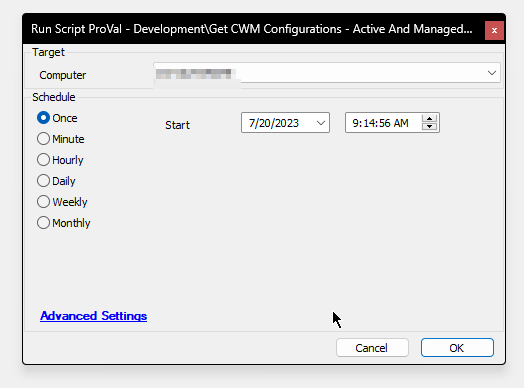
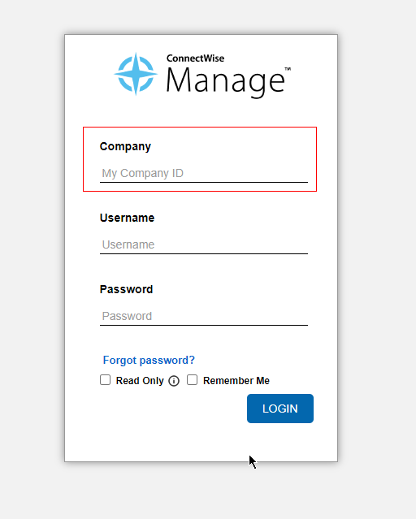

## Summary

The script fetches basic information from ConnectWise Manage configurations and stores it in a custom table [CWM - Automate - Custom Table - pvl_cwm_configurations](<../tables/pvl_cwm_configurations.md>), which is further displayed by the [CWM - Automate - Dataview - Asset Report - Purchase and Expiration Date](<../dataviews/Asset Report - Purchase and Expiration Date.md>) dataview.

## Sample Run

## Sub-Script

[CWM - Automate - Script - OverFlowedVariable - SQL Insert - Execute](<./OverFlowedVariable - SQL Insert - Execute.md>)

## Variables

| Name                | Description                                                                                      |
|---------------------|--------------------------------------------------------------------------------------------------|
| ProjectName         | Get-CWMConfiguration                                                                             |
| WorkingDirectory     | C:/ProgramData/_automation/Script/Get-CWMConfiguration                                          |
| JsonFileName        | Get-CWMConfiguration.Json                                                                        |
| TableName           | [pvl_cwm_configurations](<../tables/pvl_cwm_configurations.md>)                               |
| SQLDeleteStatement   | Stores SQL query to remove stale data from [pvl_cwm_configurations](<../tables/pvl_cwm_configurations.md>) table |
| SQLStartStatement    | Stores SQL query to input new data into [pvl_cwm_configurations](<../tables/pvl_cwm_configurations.md>) table |

#### Global Parameters

| Name          | Example                                         | Required | Description                                                                                      |
|---------------|-------------------------------------------------|----------|--------------------------------------------------------------------------------------------------|
| serverurl     | [stage.cwmanage.com](http://stage.cwmanage.com) | True     | ConnectWise Manage Instance URL without http or https.                                          |
| CompanyID     | CWManage                                       | True     | CompanyID used to access the CW Manage instance.  |
| PublicKey     | abC1dEFg23HIjk45L                             | True     | Public API Key                                                                                   |
| PrivateKey    | L54kjIH32gFEd1ae87                            | True     | Private API Key                                                                                  |
| CWMClientid   | 97e76471-52b5-43c9-a5ec-0153ec905881         | True     | ClientID provided by ConnectWise for API development                                             |

How to create API Keys: [How to Create API Keys](https://connectwise20.my.site.com/serviceandsupport/s/article/How-to-Create-API-Keys)

How to get clientID: [Request to get a Client ID](https://connectwise20.my.site.com/serviceandsupport/s/article/Request-to-get-a-Client-ID)

## Output

- Script Log
- Custom Table
- Dataview

