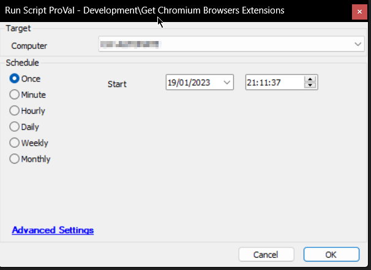

## Summary

This script is an Automate implementation of the agnostic script [EPM - Data Collection - Agnostic - Script - Get-ChromiumExtensions](<../../powershell/Get-ChromiumExtensions.md>).

## Sample Run

## Dependencies

- [Get Installed Browsers Extensions [DV]](<./Get Installed Browsers Extensions DV.md>)
- [OverFlowedVariable - SQL Insert - Execute](<./OverFlowedVariable - SQL Insert - Execute.md>)

## Process

- Creates the [Plugin_ProVal_Browsers_Extensions](<../tables/Plugin_ProVal_Browsers_Extensions.md>) script if it does not exist.
- Defines the necessary variables.
- Executes the agnostic script [EPM - Data Collection - Agnostic - Script - Get-ChromiumExtensions](<../../powershell/Get-ChromiumExtensions.md>) and stores the data into a JSON file.
- Clears the stale data.
- Executes the [OverFlowedVariable - SQL Insert - Execute](<./OverFlowedVariable - SQL Insert - Execute.md>) script to parse through the JSON file and insert the data into the [Plugin_ProVal_Browsers_Extensions](<../tables/Plugin_ProVal_Browsers_Extensions.md>) table.
- Logs the successes and failures.

## Output

- Script Log
- Custom Table
- Dataview
