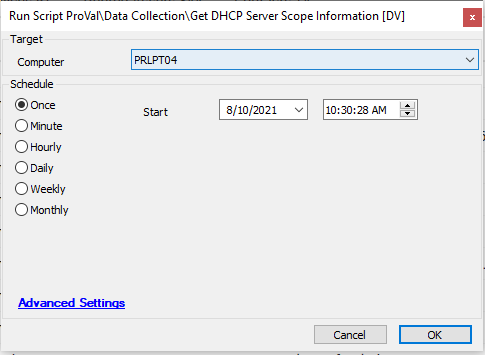

## Summary

This script gathers DHCP information from a target server and saves it to the database for use in a data view or report.

Time Saved by Automation: 5 Minutes

## Sample Run

## Process

- Runs PowerShell command to gather DHCP information from a target server
- Creates the [plugin_proval_dhcp_statistics](https://proval.itglue.com/DOC-5078775-8038845) table if it does not exist.

## Output

- Table plugin_proval_dhcp_statistics

