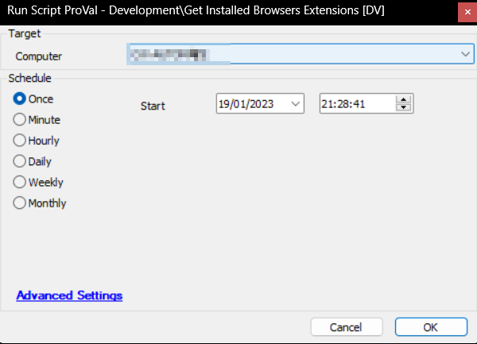

## Summary

This script gathers all the extensions installed on the Google Chrome, Microsoft Edge, Brave, and Mozilla Firefox browsers. It's a wrapper script that executes the [Get Chromium Browsers Extensions](<./Get Chromium Browsers Extensions.md>) and [Get Firefox Browser Extensions](<./Get Firefox Browser Extensions.md>) scripts.

## Sample Run

## Dependencies

- [Get Chromium Browsers Extensions](<./Get Chromium Browsers Extensions.md>)
- [Get Firefox Browser Extensions](<./Get Firefox Browser Extensions.md>)
- [CWM - Automate - Dataview - Installed Browsers Extensions [Script]](<../dataviews/Installed Browsers Extensions Script.md>)

## Variables

| Name    | Description                                        |
|---------|----------------------------------------------------|
| Browser | Used to check the name of the installed browser.   |

## Process

- Refresh software inventory.
- Look for the installed browsers.
- Execute the [Get Chromium Browsers Extensions](<./Get Chromium Browsers Extensions.md>) script if any of the `Google Chrome`, `Brave`, or `Microsoft Edge` browsers are installed.
- Execute the [Get Firefox Browser Extensions](<./Get Firefox Browser Extensions.md>) script if the `Mozilla Firefox` browser is installed.

## Output

- Dataview

