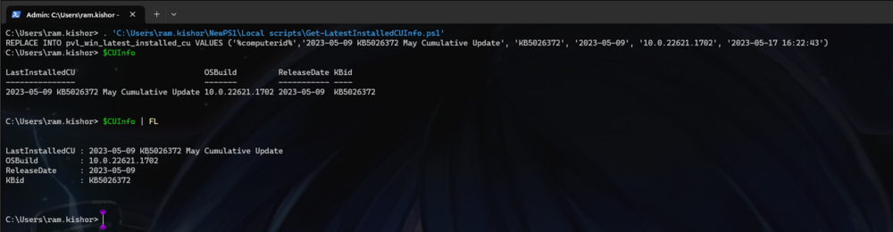
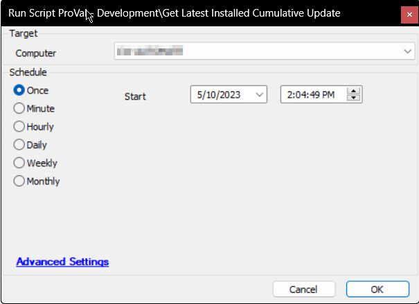

## Summary

The purpose of the script is to fetch the latest installed Cumulative Update and the Full Build Number of a Windows computer.  
e.g.,  
  

The data is then stored in the custom table [CWM - Automate - Custom Table - pvl_win_latest_installed_cu](/docs/c03e4def-7efe-4a8b-99e9-d99ac2c65f5a).  

It is an Automate implementation of the agnostic script [EPM - Windows Update - Agnostic - Get-LatestInstalledCU](/docs/81d82975-889b-49e4-b229-36d4f162a4ff).

## Sample Run

  

## Variables

| Name                  | Description                                                                                                                                                   |
|-----------------------|---------------------------------------------------------------------------------------------------------------------------------------------------------------|
| ProjectName           | Get-LatestInstalledCU                                                                                                                                       |
| WorkingDirectory       | C:/ProgramData/_automation/script/Get-LatestInstalledCU                                                                                                     |
| TableName             | [pvl_win_latest_installed_cu](/docs/c03e4def-7efe-4a8b-99e9-d99ac2c65f5a)                                                                                 |
| SQLReplaceStatement   | `REPLACE` statement returned by the PowerShell script to update the data in the custom table                                                                 |
| OSBuild               | Full OS Build of the computer                                                                                                                                 |
| MaxReleaseDate        | Maximum CU release date stored in the database for `@OSBuild@`. Used to verify whether the computer's history has returned correct CU information or not. |

## Output

- Custom Table
- Dataview

