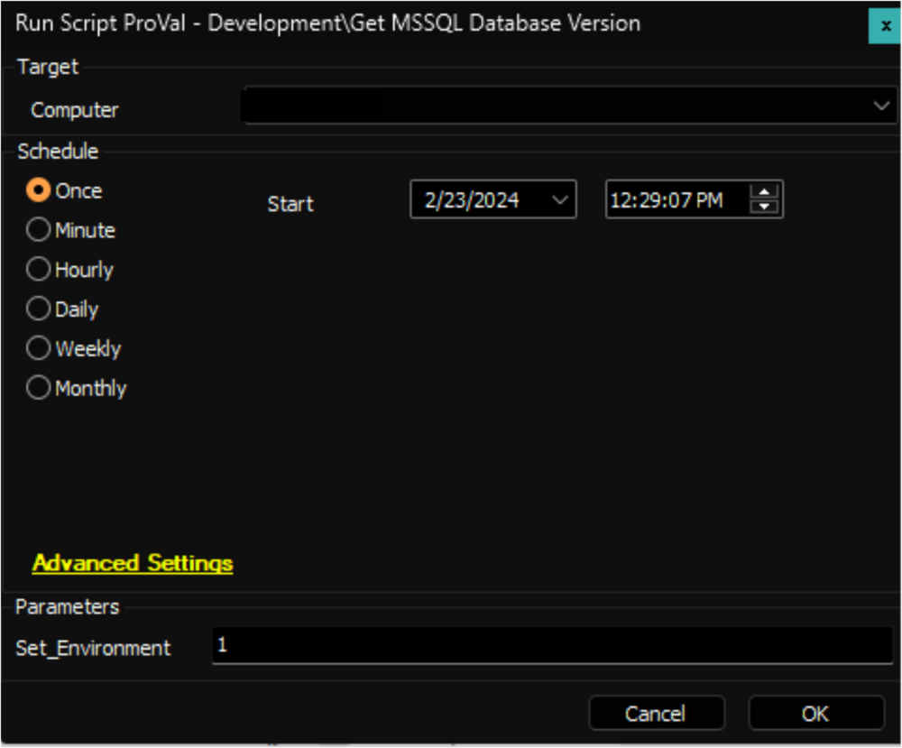
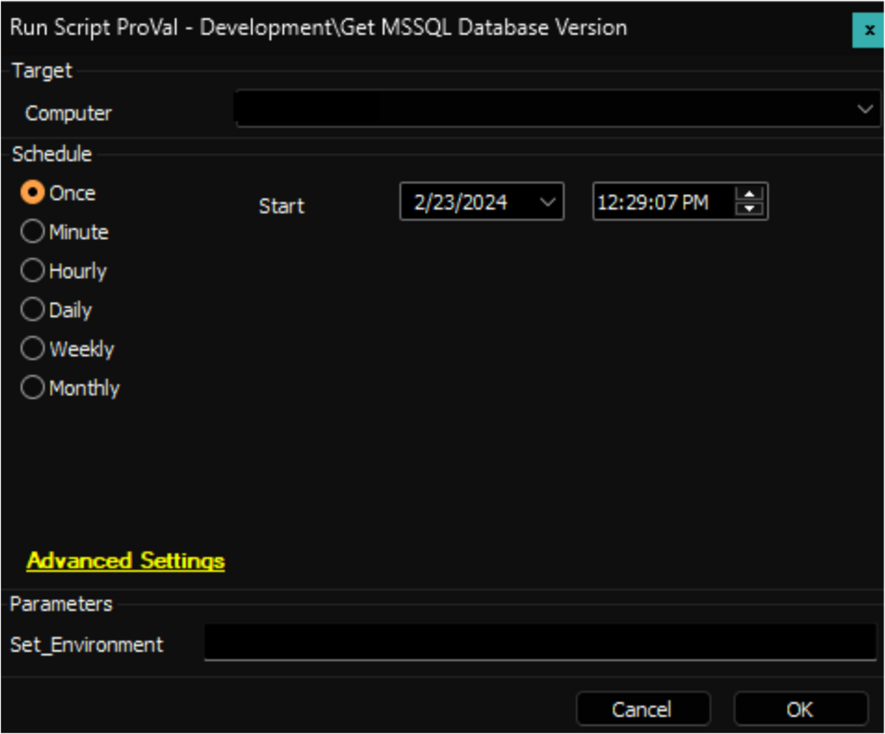

## Summary

The script collects the `Version` and `Patch Level` information of the MSSQL Server and then saves this data into a designated [Custom Table - pvl_mssql_db_version](<../tables/pvl_mssql_db_version.md>).

## Sample Run

**First Execution:**  
Execute the script against any online Windows machine with the `Set_Environment` parameter set to `1` to create the custom table.  

**Regular Executions:**  
Execute the script against the online `MSSQL` servers to gather the version.  

## Dependencies

[Internal Monitor - Execute Script - Get MSSQL Database Version](<../monitors/Execute Script - Get MSSQL Database Version.md>)

## Variables

| Name              | Description                                           |
|-------------------|-------------------------------------------------------|
| ProjectName       | Get-MSSQLDBVersion                                   |
| WorkingDirectory   | C:/ProgramData/_automation/script/Get-MSSQLDBVersion |
| TableName         | [pvl_mssql_db_version](<../tables/pvl_mssql_db_version.md>) |

## User Parameter

| Name              | Example | Mandatory | Description                                                                                                         |
|-------------------|---------|-----------|---------------------------------------------------------------------------------------------------------------------|
| Set_Environment    | 1       | False     | Execute the script against any online Windows machine with the `Set_Environment` parameter set to `1` to create the custom table. |

## Output

- Script Log
- Custom Table
- Dataview
