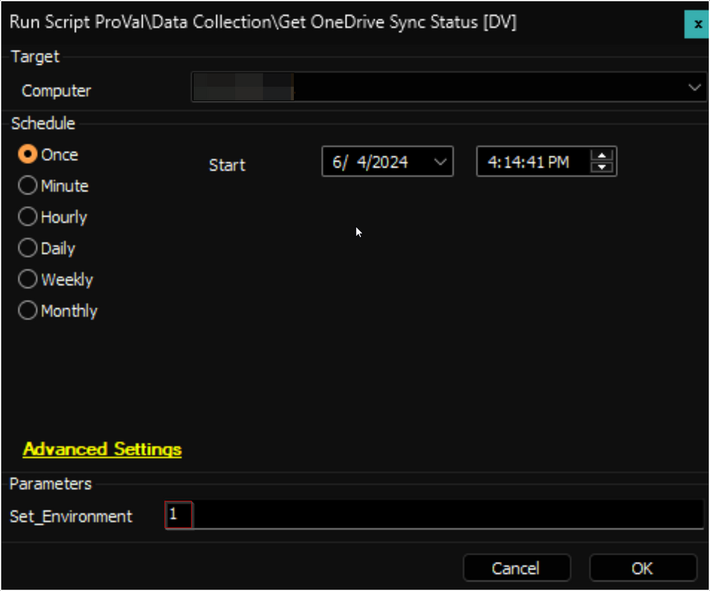
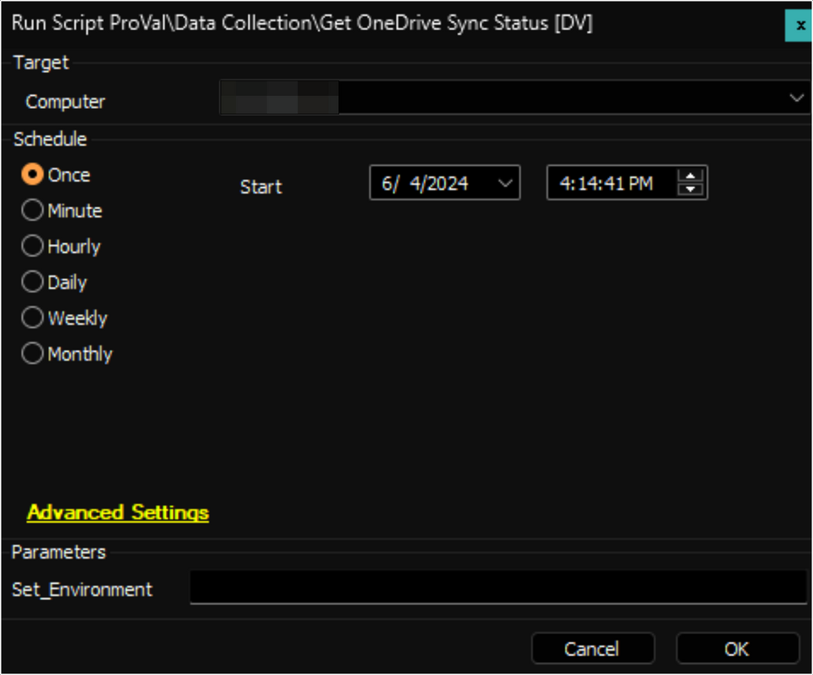
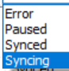

## Summary

The script employs the [Get-ODStatus.ps1](https://github.com/rodneyviana/ODSyncUtil/blob/master/ODSyncUtil/Get-ODStatus.ps1) script to retrieve the OneDrive Sync Status and Quota Information. This data is then stored in a custom table. A user must be logged on to the machine to use the script.

## Sample Run

First Run: Run the script against any online Windows machine with the `Set_Environment` parameter set to `1` to create the custom table [pvl_odsync_status](https://proval.itglue.com/DOC-5078775-16007815).

Regular Execution:  

## User Parameters

| Name            | Example | Required                | Description                                                                                                                                                       |
|-----------------|---------|-------------------------|-------------------------------------------------------------------------------------------------------------------------------------------------------------------|
| Set_Environment  | 1       | For First Execution      | Run the script against any online windows machine with the `Set_Environment` parameter set to `1` to create the custom table [pvl_odsync_status](https://proval.itglue.com/DOC-5078775-16007815). |

## Output

- Custom Table  
- Dataview
- Script Log

## FAQ

1. Is the OneDrive Sync Status in the [Dataview - OneDrive Sync Status [Script]](https://proval.itglue.com/DOC-5078775-16007808) contains the data for the OneDrive Sync or Script?  
   Ans: The data in the OneDrive Sync Status is the OneDrive Sync data, not the script data.  
   

2. Can this script be run in the environment where a security application is applied?  
   Ans: Yes, you just need to whitelist the below hashes:  
   C:/ProgramData/_Automation/Script/ODSync/ODSyncUtility.ps1: -> **A5EBD70394BA53B0D3A093FB47C94985**  
   C:/ProgramData/_Automation/Script/ODSyncUtil/ODSyncFetch.ps1: -> **4626F936E0BABCE79F350E096671A19F**  

