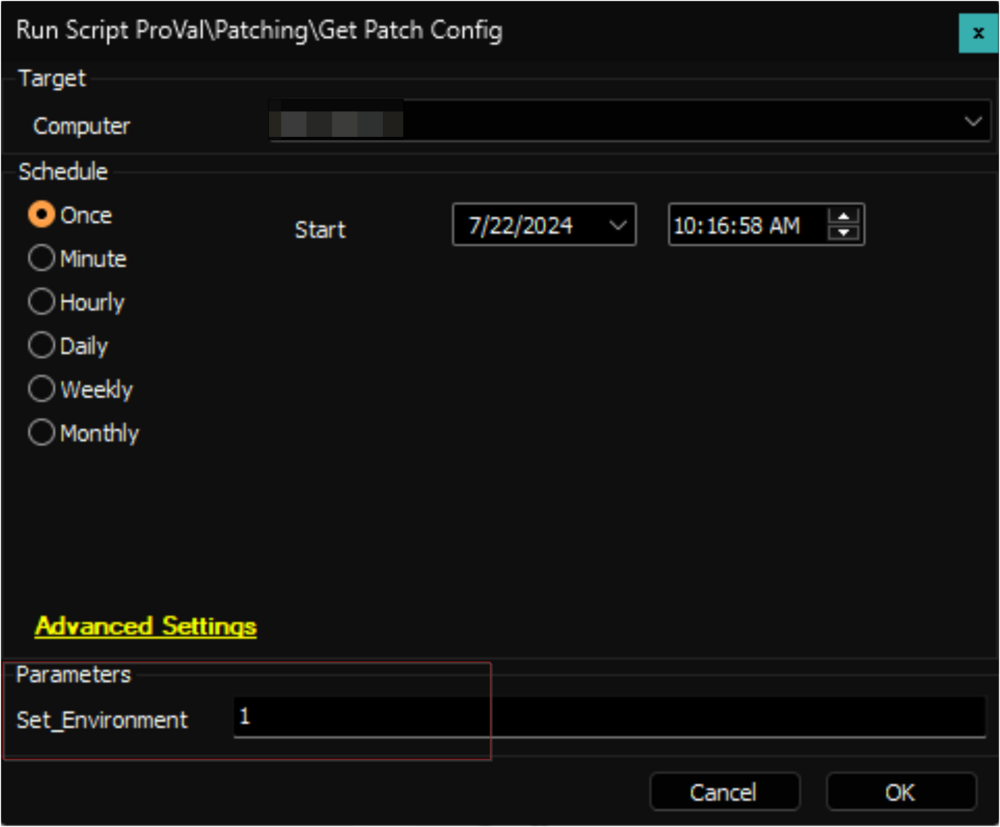
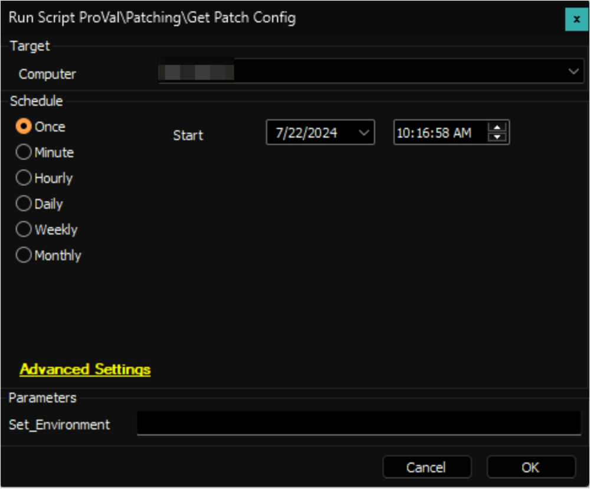

## Summary

This Automate implementation of the [Get-PatchConfig](<../../powershell/Get-PatchConfig.md>) agnostic script effectively retrieves and stores the essential data needed to validate the changes made by the [WUA Settings Validation](<./Patch Manager - WUA Settings Validation.md>) script into a custom table.

**File Path:** `C:/ProgramData/_Automation/script/Get-PatchConfig/Get-PatchConfig.ps1`  
**File Hash (Sha256):** `0273E2B1D4A623A6AFD274B7E861D75225D8A5464FE51A5971ED331C7D7861E2`  
**File Hash (MD5):** `589E54907484FC449A129BEB2C47D246`  

**File Path:** `C:/ProgramData/_Automation/script/Get-PatchConfig/Get-PatchConfigAI.ps1`  
**File Hash (Sha256):** `2854B758DBF02E43657BF9EC6C12048A931F422F101BD1F16CA30E3B5852B5DD`  
**File Hash (MD5):** `E37E8AB0FCF3DCCBBD17E43BF34FB8E8`  

## Update Notice: 29-Oct-2024

The script has been updated to indicate whether Windows upgrades or feature updates are restricted from the registry key for Windows 10 and 11.  
Reference: [https://admx.help/?Category=Windows_10_2016&Policy=Microsoft.Policies.WindowsUpdate::TargetReleaseVersion](https://admx.help/?Category=Windows_10_2016&Policy=Microsoft.Policies.WindowsUpdate::TargetReleaseVersion)

Execute the script against any online Windows computer with the `Set_Environment` parameter set to `1`. This will add the newly introduced column `upgradeRestricted` to the [pvl_patch_config](<../tables/pvl_patch_config.md>) table which is necessary for the solution.  

## Sample Run

**First Execution:** Execute the script against any online Windows computer with the `Set_Environment` parameter set to `1`. This will create the [pvl_patch_config](<../tables/pvl_patch_config.md>) table which is necessary for the solution.  

**Regular Execution:**  

## Dependencies

[EPM - Data Collection - Agnostic - Script - Get-PatchConfig](<../../powershell/Get-PatchConfig.md>)  

## Variables

| Name              | Description                       |
|-------------------|-----------------------------------|
| TableName         | pvl_patch_config                  |
| ProjectName       | Get-PatchConfig                   |
| WorkingDirectory   | C:/ProgramData/_Automation/Script/Get-PatchConfig |

## User Parameters

| Name              | Example | Required                      | Description                                                                                      |
|-------------------|---------|-------------------------------|--------------------------------------------------------------------------------------------------|
| Set_Environment    | 1       | True (For first execution)    | Execute the script with this parameter set to 1 after importing it to create the [pvl_patch_config](<../tables/pvl_patch_config.md>) table. |

## Output

- Script log
- Local file on computer
- Custom Table
- Dataview

