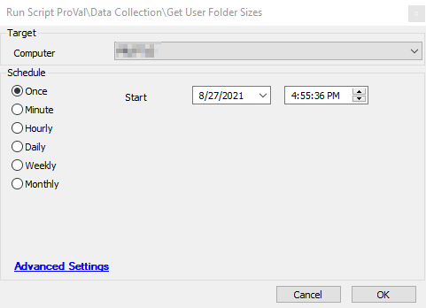

## Summary

This script runs PowerShell to fetch the size (in MB) of every user folder found on a machine.

**Time Saved by Automation:** 15 Minutes

## Sample Run

## Process

- Creates a custom table [plugin_proval_userfoldersizes](/docs/e47be58e-d72d-4396-aa0c-edef63f056e8) in the Labtech Database if it doesn't already exist.
- Runs the PowerShell script to fetch the folder size of every user profile.
- Inserts the values into the above table.

## Output

- Script log

