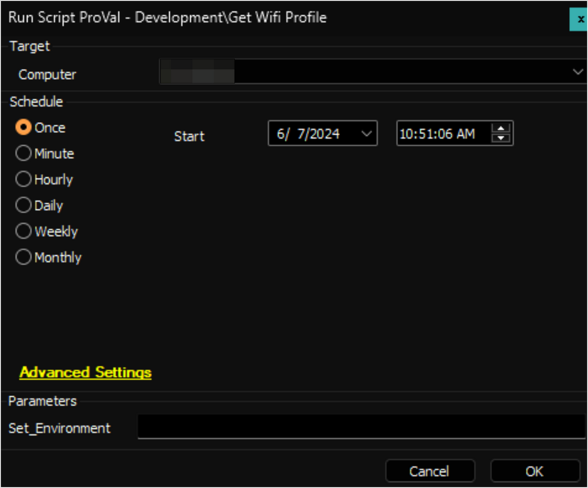

## Summary

The script is an Automate implementation of the agnostic script [Get-WifiProfile](<../../powershell/Get-WifiProfile.md>). It retrieves details about Wi-Fi profiles stored on designated end-user machines.

## Sample Run

- For the first execution of the script, the value of the user parameter `Set_Environment` should be set to `1`. This will create the EDF, System property, and [custom table](https://proval.itglue.com/5078775/docs/12979849) used by the [Implement Wifi Profile](https://proval.itglue.com/DOC-5078775-16111352) solution:  
    

- Regular execution:  
    

## Variables

| Name               | Description                                          |
|--------------------|------------------------------------------------------|
| ProjectName        | Get-WifiProfile                                      |
| WorkingDirectory    | C:/ProgramData/_Automation/Script/Get-WifiProfile   |
| PS1Log             | C:/ProgramData/_Automation/Script/Get-WifiProfile-Log.txt |
| PS1ErrorLog        | C:/ProgramData/_Automation/Script/Get-WifiProfile-Error.txt |
| TableName          | [pvl_wifi_profiles](<../tables/pvl_wifi_profiles.md>) |

#### User Parameters

| Name               | Example | Required              | Description                                                                 |
|--------------------|---------|-----------------------|-----------------------------------------------------------------------------|
| Set_Environment     | 1       | True for the first run | It is mandatory to set this parameter to 1 for the very first execution of the script. |

## Output

- Script Log
- Dataview

