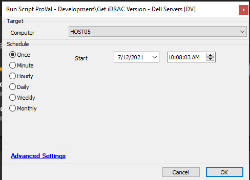

## Summary

The script will fetch the version of iDRAC from Dell servers. The script output will be stored in a script state which is used by the dataview [iDRAC Version - Dell Servers](https://proval.itglue.com/DOC-5078775-7854512).

Time Saved by Automation: 5 Minutes

## Sample Run

## Variables

`@iDRAC@`: Storing the formatted iDRAC Version from `%shellresult%` and is further used to store the value in the script state "iDRAC_Version".

#### Script States

| Name          | Example       | Description                                         |
|---------------|---------------|-----------------------------------------------------|
| iDRAC_Version | 2.61.60.60    | Version of iDRAC of the concern Dell Server.       |

## Process

- It will work for Dell Servers only.
- Checks if the computer is a Dell Server or not.
- Run the `racadm getversion -f idrac` command to fetch the iDRAC Version.
- Sets a Variable `@iDRAC@` using SQL Query `SELECT TRIM(SUBSTRING_INDEX('%shellresult%','=',-1)) AS iDRAC Version` to fetch the numerical value out of the shell result.
- Assign that value to the script state `iDRAC_Version`.
- The output of the script can be checked from "iDRAC Version - Dell Servers" Dataview.

## Output

- Script log
- Script state
- Dataview

