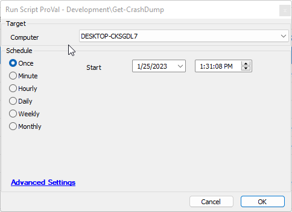
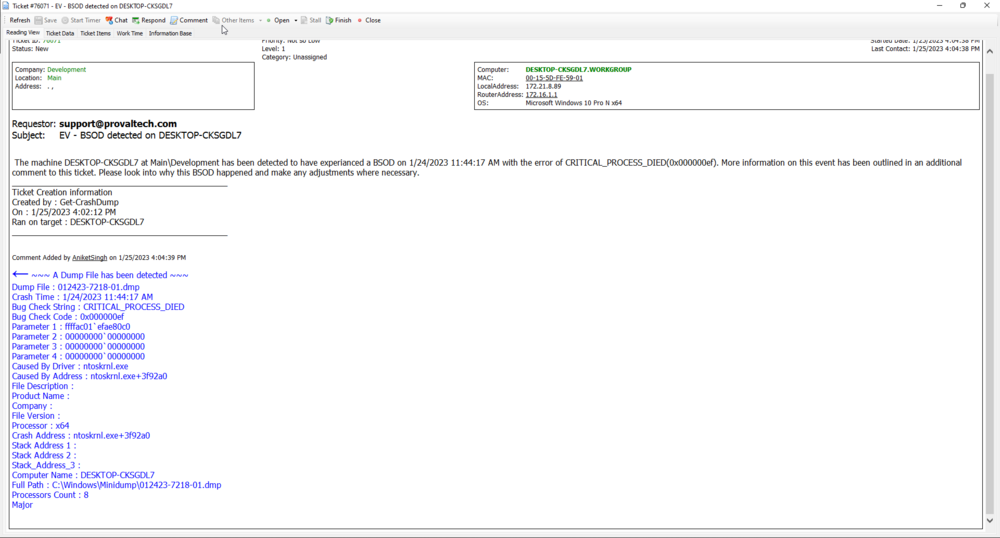
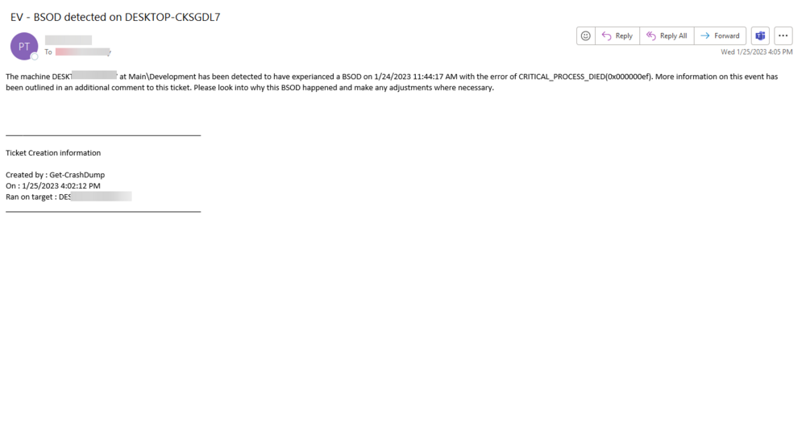
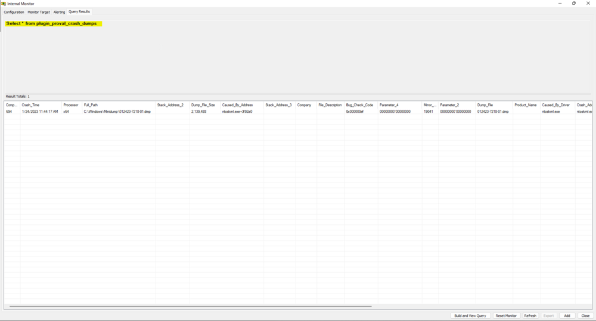

## Summary

This document collects information regarding any existing crash dumps.

## Sample Run

- To collect data, run the Get-CrashDump script on a target endpoint.

### Expected Return Types

- Ticket
- Email
- Custom Table

## Dependencies

- [SWM - Software Installation - Script - Winget - Install](<./Winget - InstallUpdate.md>)
- [SWM - Software Management - Powershell - Invoke-WingetProcessor](<../../powershell/Invoke-WingetProcessor.md>)
- [EPM - Data Collection - Custom Table - plugin_proval_crash_dumps](<../tables/plugin_proval_crash_dumps.md>)

## Variables

| Name                | Description                                                                                                       |
|---------------------|-------------------------------------------------------------------------------------------------------------------|
| Name                | Used with the Winget - Install script; specifies the winget package to install.                                  |
| Scope               | Used with the Winget - Install script; specifies the store that the package resides in.                          |
| psout               | The return from PowerShell will be in a pipe-separated name = value format. When we split this return, we should expect the following variables to be created: <ul><li>processor</li><li>full_path</li><li>stack_address_2</li><li>crash_time</li><li>dump_file_size</li><li>caused_by_address</li><li>stack_address_3</li><li>major_version</li><li>stack_address_1</li><li>company</li><li>file_description</li><li>bug_check_code</li><li>parameter_4</li><li>minor_version</li><li>parameter_2</li><li>dump_file</li><li>product_name</li><li>caused_by_driver</li><li>crash_address</li><li>parameter_3</li><li>parameter_1</li><li>bug_check_string</li><li>file_version</li><li>dump_file_time</li><li>computer_name</li><li>processors_count</li></ul> |
| Subject             | The subject line of a ticket/email.                                                                               |
| Body                | The initial body of a ticket/email.                                                                               |
| Comment             | The additional comment sent to the ticket containing all the variables returned from psout.                      |
| Sqlstartstatement   | The first part of an SQL start statement from "insert into" to "values."                                        |
| SQLData             | The second half of the SQL insert statement containing all data provided by the split variables obtained from psout.|

#### Global Parameters

| Name                          | Example                     | Required | Description                                                                                       |
|-------------------------------|-----------------------------|----------|---------------------------------------------------------------------------------------------------|
| CreateTicket                  | 0                           | True     | 0 = Disabled, 1 = Enabled                                                                         |
| EmailTo                       | [Somebody@SomePlace.com](mailto:Somebody@SomePlace.com) | False    | A report recipient's email address.                                                                |
| TicketCreationCategory        | 15                          | False    | The ticket creation category to apply to a ticket                                                |
| Threshold                     | 7                           | True     | The time in minutes to search back for to find an offending dump log.                             |
| TableName                     | plugin_proval_crash_dumps  | True     | This designates a table to write to with found data.                                             |
| CreateTable                   | 0                           | True     | 0 = Disabled, 1 = Enabled                                                                         |
| ConfigureLoggingRegistryValue  | 0 or 1                    | True     | 0 = Disabled, 1 = Enabled. Enables the changing of the CrashDumpEnabled registry value to 3.   |

## Process

1. If `C:/windows/minidump` does not exist, exit as a bluescreen has not been logged or the registry value `CrashDumpEnabled` has not been set to a compatible value.
   - If you set `ConfigureLoggingRegistryValue` to 1, the script will set the registry value to a compatible value.
2. Resend the software list and check for NirSoft BlueScreenView; if it exists, skip to step 5.
3. Set the Name variable to `NirSoft BlueScreenView`.
4. Run the Winget - Install script.
5. Run the following steps in PowerShell on the target machine:
   - Use BlueScreenView CLI to export an XML of the found dump to `c:/temp/dumphtml.xml`.
   - Read the XML and format the return.
   - Return the result.
6. Split the `psout` variable.
7. If we are not creating a ticket, skip to step 9.
8. Create a ticket, then add a comment with all the data.
9. If we are not sending an email, skip to step 11.
10. Send the email to the required recipient.
11. If we are not adding data to a custom table, then exit.
12. Populate the custom table with the retrieved data.

## Output

- Script log
- Ticket
- Email
- Custom Table

## Expected Outcome

### Ticket

### Email

### Custom Table

