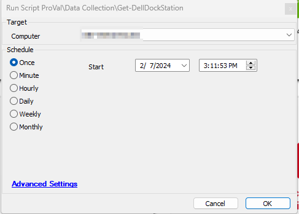
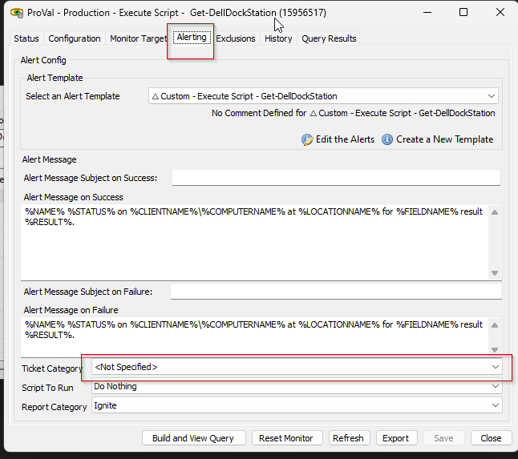

## Summary

This script detects Dell Dockstation on Dell Workstations. Since `Dell Command | Monitor` is required to be installed to detect the dockstations, it will install it if it's not already installed and will proceed to run the commands to detect Dockstations.

The script will validate the prerequisites before attempting to install the application. It can create a ticket if the pre-req validation fails. It will also attempt to install `Microsoft Visual C++ 2015-2022 Redistributable` if the required version is not installed.

Computer level EDF `Unsupported Dell Bios` will be marked for the computers not having a supported BIOS.

Pre-req:  
[Prerequisites for Systems Running on Windows](https://www.dell.com/support/manuals/en-us/command-monitor/dellcommandmonitor_rn/prerequisites-for-systems-running-on-windows?guid=guid-aa49b007-8eb3-496b-851b-d2131a8c74b6&lang=en-us)

## Dependencies

[CWM - Automate - Script - OverFlowedVariable - SQL Insert - Execute](https://proval.itglue.com/DOC-5078775-10546355)  

Note: Since [this installer](https://dl.dell.com/FOLDER11078318M/1/Dell-Command-Monitor_KF06N_WIN_10.10.1.13_A00.EXE) works just with a browser, it can be used in the script to download the installer on the machine. Download the installer on the Client Ltshare and share its path in the script at Line 42.

## Target

Windows 10, Windows 11 Workstations

## Sample Run

This script is designed to be run as an autofix with the [Internal Monitor - Execute Script - Get-DellDockStation](https://proval.itglue.com/DOC-5078775-15073356).  

Also, it can be run manually  

## Output

- Script Logs
- Tickets

## Ticketing

Set the `Ticket Category` in the [Execute Script - Get-DellDockStation](https://proval.itglue.com/DOC-5078775-15073356) monitor set to enable ticketing for `Dell Command | Monitor` installation failure.  

**Subject:** Dell Command | Monitor Installation Failed  

