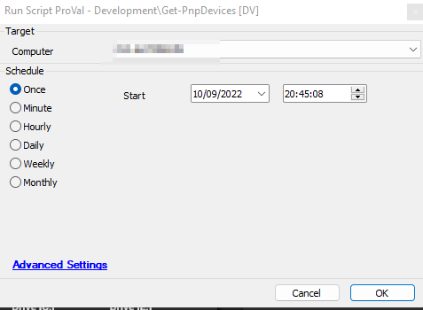

## Summary

This script will collect information about the installed [PnP Devices](https://docs.microsoft.com/en-us/windows-hardware/drivers/kernel/introduction-to-plug-and-play) and stores it in the custom table [Plugin_ProVal_PnpDevices](https://proval.itglue.com/DOC-5078775-10861699).

Intended Target: Windows Computers

## Sample Run

## Dependencies

- [CWM - Automate - Dataview - Get-PNPDevices [Script]](https://proval.itglue.com/DOC-5078775-10861702) 
- [CWM - Automate - Solution - Pnp Devices Inventory](https://proval.itglue.com/DOC-5078775-10861710) 
- [CWM - Automate - Custom Table - plugin_proval_pnpdevices](https://proval.itglue.com/DOC-5078775-10861699) 

## Variables

| Name            | Description                                                                                       |
|-----------------|---------------------------------------------------------------------------------------------------|
| InsertStatement | Result of the PowerShell Script attempted to retrieve the [PnP Devices](https://docs.microsoft.com/en-us/windows-hardware/drivers/kernel/introduction-to-plug-and-play) information |

## Process

1. Creating the [Plugin_ProVal_PnpDevices](https://proval.itglue.com/DOC-5078775-10861699) table if it already not exists.
2. Running the PowerShell script to retrieve information about installed [PnP Devices](https://docs.microsoft.com/en-us/windows-hardware/drivers/kernel/introduction-to-plug-and-play).
3. Verifying the Outcome.
4. Parsing the Outcome to ensure SQL compatibility.
5. Inserting the data to the [Plugin_ProVal_PnpDevices](https://proval.itglue.com/DOC-5078775-10861699) Table.
6. Logging the Failure.

## Output

- Script Log
- Dataview

