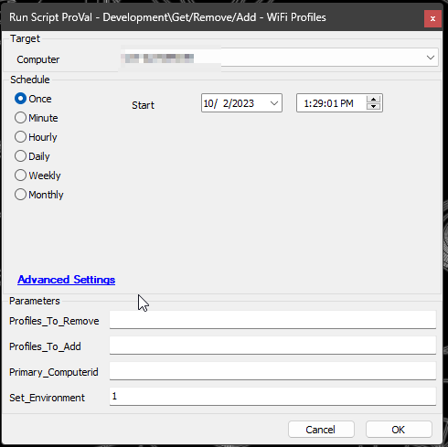
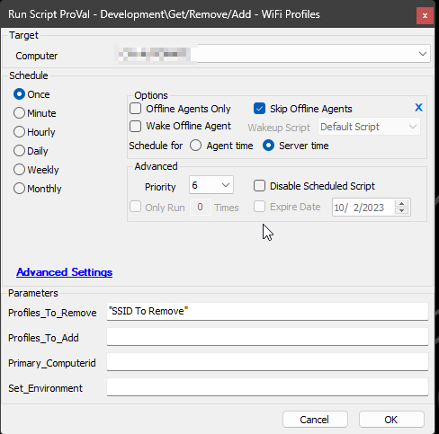
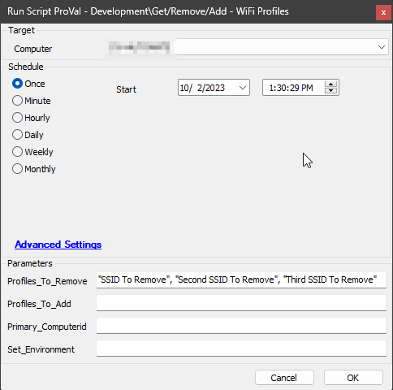
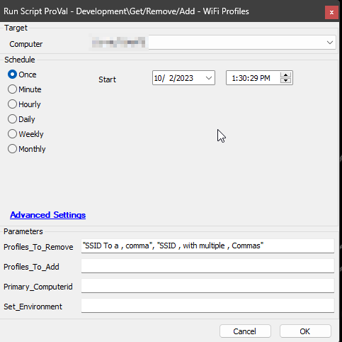
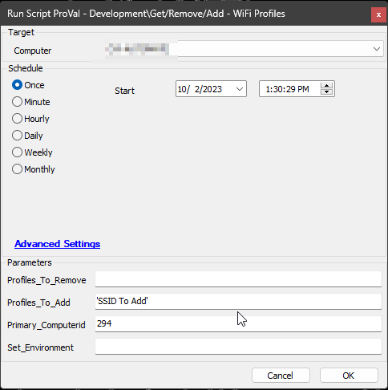
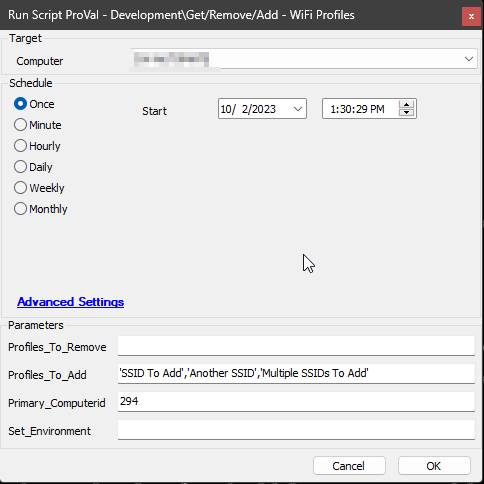
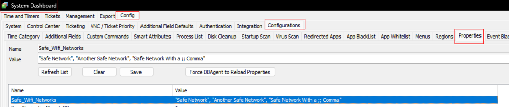
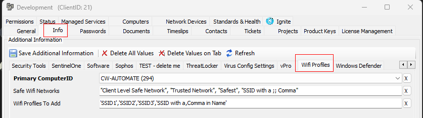
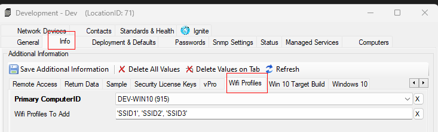
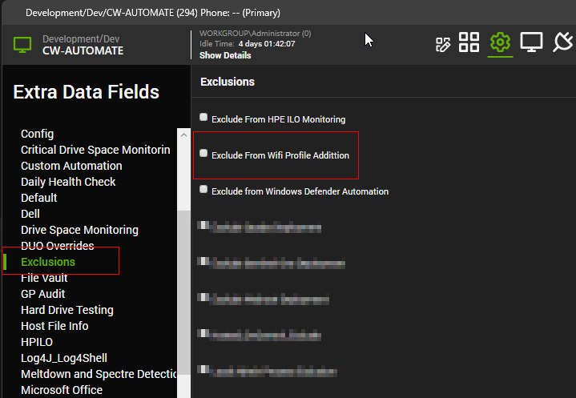

## Summary

The objective of this script is to retrieve details about Wi-Fi profiles stored on designated end-user machines. The script specifically targets computers equipped with a Wi-Fi adapter.

Furthermore, the script possesses the capability to both remove and add Wi-Fi profiles on the targeted machines. To initiate removal, the names of the desired Wi-Fi profiles are to be supplied to the script parameter named `Profiles_To_Remove`. Conversely, for adding profiles, the respective profile names should be provided to the `Profiles_To_Add` parameter.

It is important to note that the addition of profiles can also be managed through the Client/Location level EDFs, as further elucidated in this document.

## Update Notes - 2 Oct, 2023

- The script, formerly named `Get/Remove Wifi Profiles`, has been rebranded to `Get/Remove/Add Wifi Profiles`.
- In this updated version, a new feature has been incorporated to enable the addition of Wi-Fi profiles in addition to removal. Two new user parameters, namely `Profiles_To_Add` and `Primary_Computerid`, have been introduced to facilitate this functionality.
- To accommodate the storage of encrypted passwords, a new column has been added to the [pvl_wifi_profiles](<../tables/pvl_wifi_profiles.md>) table.
- Notably, the updated script will not function as intended unless executed with the `Set_Environment` user parameter set to `1` post-update.
- Moreover, this update necessitates the removal of existing data within the [pvl_wifi_profiles](<../tables/pvl_wifi_profiles.md>) table and the [Wi-Fi Profile - Audit [Script]](<../dataviews/WiFi Profile - Audit Script.md>) dataview.
- Client-Level and Location-Level EDFs `Primary ComputerID` and `Wifi Profiles To Add` are introduced. Setting both EDFs at either level will activate the [CWM - Automate - Internal Monitor - Add - Wifi Profiles](<../monitors/Add - Wifi Profiles.md>) monitor set for the client or location respectively.
- Client-Level EDF `Safe Wifi Networks` has been moved to the EDF section `Wifi Profiles` from `Security`.

## Sample Run

- For the first execution of the script, the value of the user parameter `Set_Environment` should be set to `1`. This will create the EDF, System property, and custom table used by the script:  

- The Wi-Fi Profile/SSID to remove from the computer should be provided within the `Profiles_To_Remove` parameter. Each SSID should be enclosed in double quotes and separated by a comma. If there is a comma (,) in the SSID, it should be replaced by a double semi-colon (;;).
    - Example 1: To remove a single Wi-Fi Profile  
    
    - Example 2: To remove multiple Wi-Fi Profiles  
    
    - Example 3: If there is a comma in the Wi-Fi Profile Name, e.g., `SSID with a , Comma` or `SSID , with multiple , Commas`  
    

- The Wi-Fi Profile/SSID to be added from the computer should be provided within the `Profiles_To_Add` parameter. Each SSID should be enclosed in single quotes and separated by commas. Additionally, along with the names of the profiles, the `Primary_Computerid` parameter should be set to specify the computer ID from which the profile information is to be copied. While adding an SSID with a single quotation in the name itself, a backslash should be added before the quotation. The complete name should always be enclosed between single quotations.  
  For example:  
  To add `Bob's Wifi` in the parameter, it should be passed as `'Bob\'s Wifi'`.  
  To add `Bob's Wifi`, `HR's Wifi`, and `Wifi Network X` in the parameter, it should be passed as `'Bob\'s Wifi', 'HR\'s Wifi', 'Wifi Network X'`.  
    - Example 1: To add a single Wi-Fi Profile  
    
    - Example 2: To add multiple Wi-Fi Profiles  
    

## Variables

| Name                  | Description                                                                                  |
|-----------------------|----------------------------------------------------------------------------------------------|
| STATUS                | Status returned by the Monitor Set (Success/Failure)                                        |
| Profiles_To_Remove    | CSV of the Wi-Fi Profiles to remove, excluding the safe ones from the system property and client-level EDF. |
| Profiles_To_Add       | CSV of the Wi-Fi Profiles to add; this variable is generated from the data passed via the `Profiles_To_Add` parameter and from the client and location level EDF `Wifi Profiles To Add`. |
| ProjectName           | Manage-Wifi_Profiles                                                                         |
| TableName             | pvl_wifi_profiles                                                                             |
| WorkingDirectory       | C:/ProgramData/_automation/script/Manage-Wifi_Profiles                                      |
| psout                 | Output of the PowerShell script performing the task                                          |
| InsertStatement       | Insert query returned by the PowerShell script to be inserted into the custom table         |

## User Parameters

| Name                   | Example                               | Required                              | Description                                                                                                                                                                                                                                                                                   |
|------------------------|---------------------------------------|---------------------------------------|-----------------------------------------------------------------------------------------------------------------------------------------------------------------------------------------------------------------------------------------------------------------------------------------------|
| Profiles_To_Remove     | "SSID To Remove", "Suspicious Network"| False                                 | SSID(s) of the unwanted/malicious Wi-Fi Profile(s) to remove from the end machine. Check the `Sample Run` section of the article for further details. If left blank, the script will just audit the Wi-Fi Profiles.                                                                            |
| Profiles_To_Add        | 'SSID To Add', 'Another'              | False                                 | SSID(s) of the Wi-Fi Profile(s) to add to the end machine. Check the `Sample Run` section of the article for further details. If left blank, the script will fallback to the location-level EDF `Wifi Profiles To Add` and then to the client-level EDF `Wifi Profiles To Add`.                        |
| Primary_Computerid     | 294                                   | True (if `Profiles_To_Add` parameter is used) | ID of the computer to fetch the information of the profiles to add.                                                                                                                                                                                                                         |
| Set_Environment         | 1                                     | True for the First Run                | It is mandatory to set this parameter to `1` for the very first execution of the script.                                                                                                                                                                                                        |

## System Properties

| Name                    | Example                                                                   | Required | Description                                                                                                                                                                                                                                    |
|-------------------------|---------------------------------------------------------------------------|----------|------------------------------------------------------------------------------------------------------------------------------------------------------------------------------------------------------------------------------------------------|
| Safe_Wifi_Networks      | "Safe Network", "Another Safe Network", "Safe Network With a ;; Comma"  | False    | Stores the list of globally whitelisted/safe Wi-Fi profiles. The script will not accidentally remove the profile(s) if mentioned here. Each Name/SSID should be enclosed in double quotation marks and separated by a comma.                      |

## Client-Level EDFs

| Name                   | Example                                               | Required                              | Description                                                                                                                                                                                                                                                                                   |
|------------------------|-------------------------------------------------------|---------------------------------------|-----------------------------------------------------------------------------------------------------------------------------------------------------------------------------------------------------------------------------------------------------------------------------------------------|
| Safe Wifi Networks      | "Client Level Safe Network", "Trusted Network", "Safest", "SSID with a ;; Comma" | False                                 | In addition to defining globally safe/whitelisted Wi-Fi Profiles/Networks, this EDF provides an option to define additional client-level safe/whitelisted Wi-Fi Profiles as well. The profiles/SSIDs stored here will not be removed from the machine, even if someone passes that name to the `Profiles_To_Remove` parameter. |
| Primary ComputerID      | Computer Name (Computerid)                            | True (if Client-level EDF `Wifi Profiles To Add` is set) | To store the name and ID of the computer to fetch the information of the Wi-Fi Profiles to add to the end machines of the client. It's a dropdown field with the `Name (Computerid)` of the computers of the client.                                                                                  |
| Wifi Profiles To Add    | 'SSID1', 'SSID2', 'SSID3'                            | False                                 | SSID or Name of the Wi-Fi Profile(s) to add to the end machines of the client. These Wi-Fi Profiles should be available on the computer selected in the `Primary ComputerID` EDF. Each SSID should be enclosed in single quotes and separated by commas. While adding an SSID with a single quotation in the name itself, a backslash should be added before the quotation. The complete name should always be enclosed between the single quotations. |

## Location-Level EDFs

| Name                   | Example                                               | Required                              | Description                                                                                                                                                                                                                                                                                   |
|------------------------|-------------------------------------------------------|---------------------------------------|-----------------------------------------------------------------------------------------------------------------------------------------------------------------------------------------------------------------------------------------------------------------------------------------------|
| Primary ComputerID      | Computer Name (Computerid)                            | True (if Location-level EDF `Wifi Profiles To Add` is set) | To override the information stored in the client-level EDF `Primary ComputerID`.                                                                                                                                                                                                              |
| Wifi Profiles To Add    | 'SSID1', 'SSID2', 'SSID3'                            | False                                 | To override the information stored in the client-level EDF `Wifi Profiles To Add`.                                                                                                                                                                                                            |

Location-Level EDFs can be used to override the Client-Level EDFs. The syntax used to store data in the location-level EDF `Wifi Profiles To Add` is the same as that of the client-level EDF `Wifi Profiles To Add`.

## Computer-Level EDF

| Name                               | Example      | Required | Description                                                                                                                                                                                                                                     |
|------------------------------------|--------------|----------|-------------------------------------------------------------------------------------------------------------------------------------------------------------------------------------------------------------------------------------------------|
| Exclude From Wifi Profile Addition   | Check Box    | False    | This EDF has no effect on the script but can be used to exclude the computer from the [CWM - Automate - Internal Monitor - Add - Wifi Profiles](<../monitors/Add - Wifi Profiles.md>) monitor set detections.                     |

## Output

- Script Log
- Dataview
