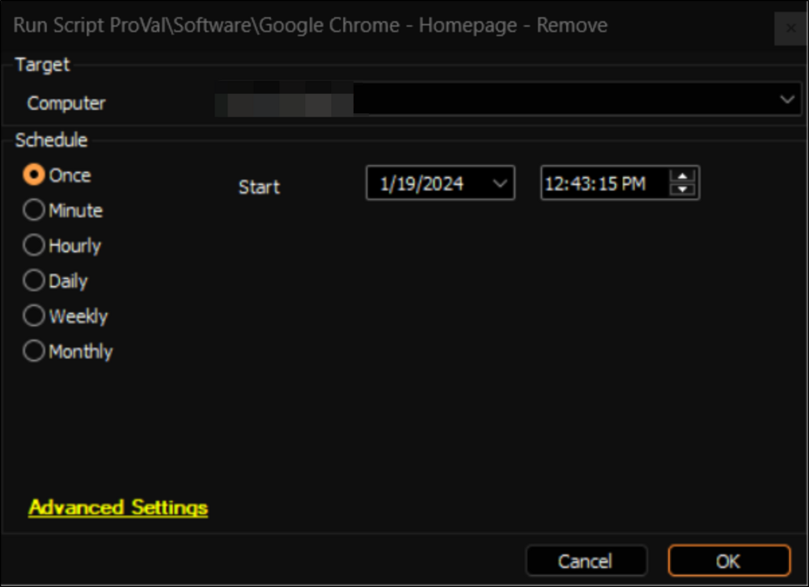

## Summary

This document describes an Automate implementation of the [SWM - Software Configuration - Remove-ChromiumHomepage](<../../powershell/Remove-ChromiumHomepage.md>) agnostic script, which is designed to remove the registry policy for an enforced homepage in Google Chrome.

## Sample Run

## Dependencies

[SWM - Software Configuration - Remove-ChromiumHomepage](<../../powershell/Remove-ChromiumHomepage.md>)

## Output

- Script Logs

