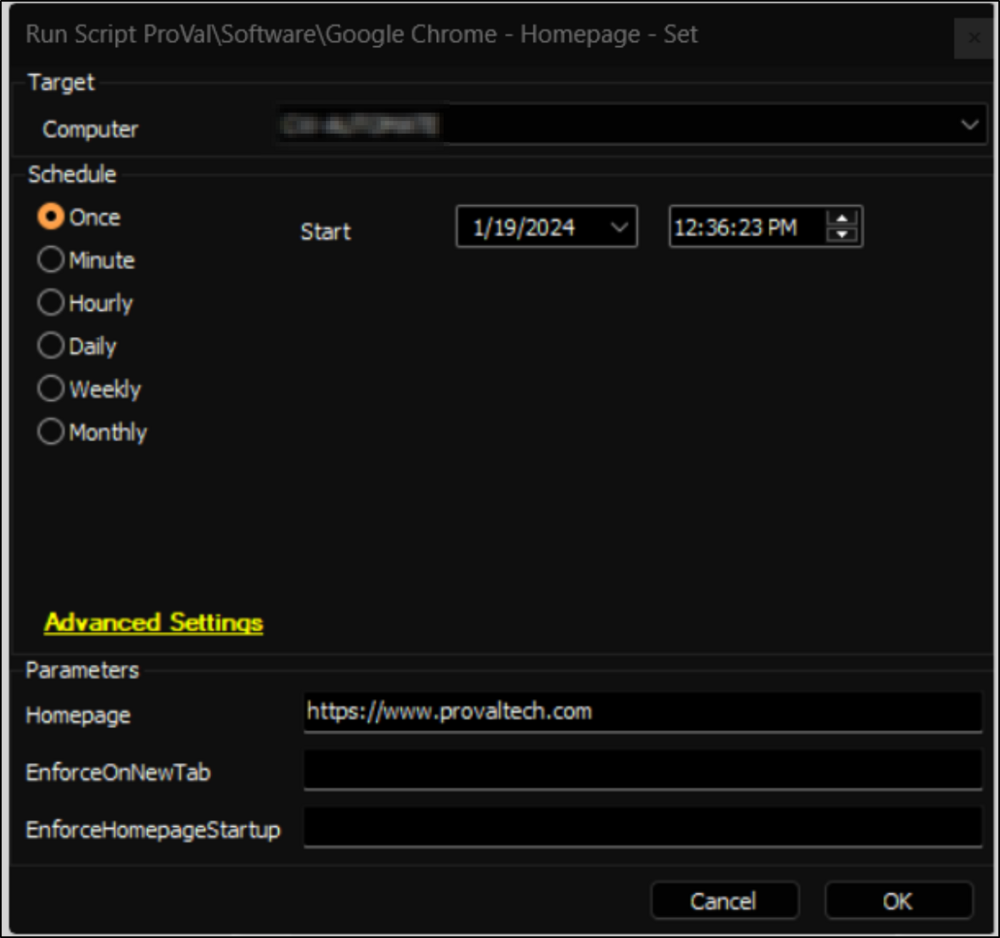

## Summary

This document outlines the Automate implementation of the agnostic script [SWM - Software Configuration - Set-ChromiumHomepage](<../../powershell/Set-ChromiumHomepage.md>), which enforces a homepage for the Google Chrome browser.

## Sample Run

## Dependencies

Refer to the [SWM - Software Configuration - Set-ChromiumHomepage](<../../powershell/Set-ChromiumHomepage.md>) for additional details.

### User Parameters

| Name                     | Example                              | Required | Description                                                          |
|--------------------------|--------------------------------------|----------|----------------------------------------------------------------------|
| Homepage                 | [https://www.provaltech.com](https://www.provaltech.com) | True     | String value of the homepage to set in the browser.                 |
| EnforceOnNewTab         | 1                                    | False    | Set to 1 to force the homepage on each new tab instead of the new tab page. |
| EnforceHomepageStartup   | 1                                    | False    | Set to 1 to force the homepage to be the only open tab at startup of the browser. |

## Output

- Script Logs

