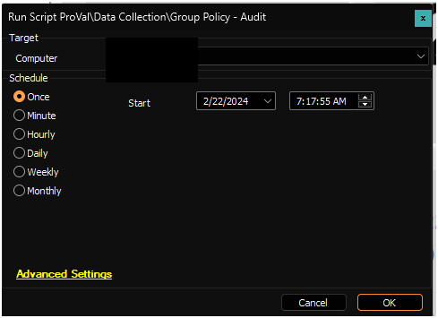

## Summary

This document outlines the implementation of the agnostic script [RSM - Active Directory - Agnostic - Start-GPOAudit](https://proval.itglue.com/DOC-5078775-7457846) within ConnectWise Automate.

## Sample Run

> 

## Dependencies

- [RSM - Active Directory - Agnostic - Start-GPOAudit](https://proval.itglue.com/DOC-5078775-7457846)

## Output

- Custom Table
- Dataview
- Script Log
