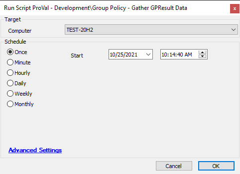

## Summary

Generates GPRESULT data and stores it in a custom table.

## Sample Run

## Dependencies

- [EPM - Windows Configuration - Agnostic - Get-GPResult](https://proval.itglue.com/DOC-5078775-8498353)

## Variables

- `@InsertStatement@` - The statement generated by the script to insert data into the table.

## Process

See [EPM - Windows Configuration - Agnostic - Get-GPResult](https://proval.itglue.com/DOC-5078775-8498353) for process information.

## Output

- Script log
- Local file on computer
- Dataview

