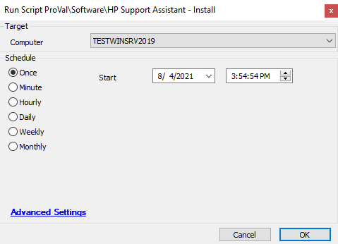

## Summary

This script downloads and installs HP support assistant if console is logged on then verifies the installation inside the script.

Time Saved by Automation: 5 Minutes

## Sample Run

## Dependencies

- Requires a user to be logged in
- File Download from: [https://ftp.hp.com/pub/softpaq/sp93001-93500/sp93097.exe](https://ftp.hp.com/pub/softpaq/sp93001-93500/sp93097.exe)

## Process

1. The script downloads the HP Support software from HP
2. Queues the install with the silent switch on the logged in user
3. Verifies if the software is detected
   - If not, logs in Automate's scripting logs a failure to install.

## Output

- Script log

