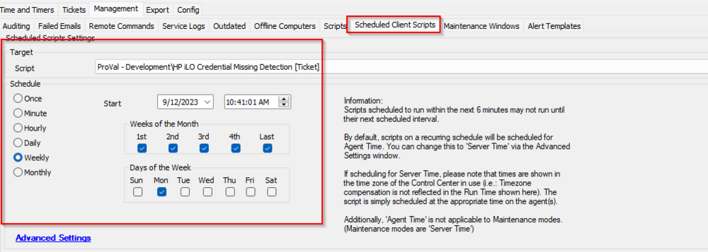

## Summary

This is a client script that creates the ticket for all clients which has an HP Server and have HP iLO enabled but the credentials are missing.

Flag the Computer-Level EDF `Exclude From HPE ILO Monitoring` to exclude a computer/server from generating ticket.

## Sample Run

## Dependencies

Computer-Level EDF - Exclude From HPE ILO Monitoring

## Implementation

- Import the script
- After import please reload the system cache and refresh the scripts to have the EDF automatically imported with the script.
- Schedule it from the dashboard -> Scheduled Client Scripts.  
  Note: This is an optional feature. Please ensure the client wants the ticketing for the missing credentials alerting.

## Output

- Script log
- Ticket

