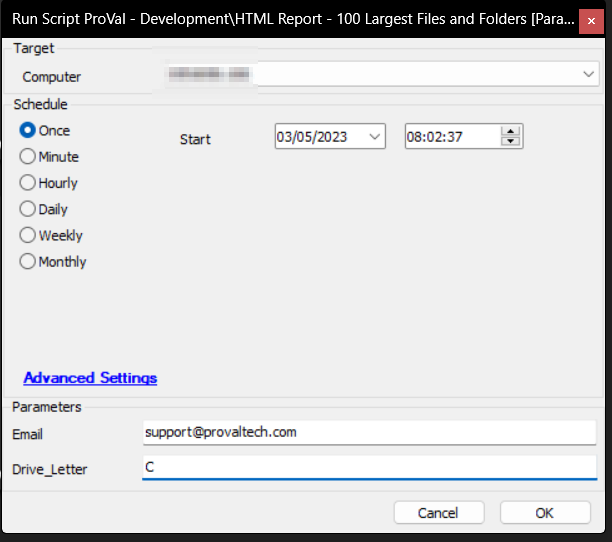
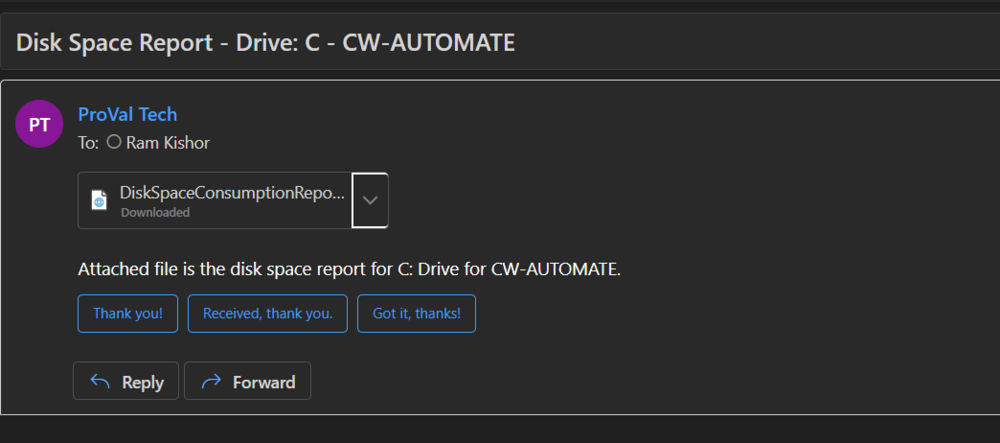
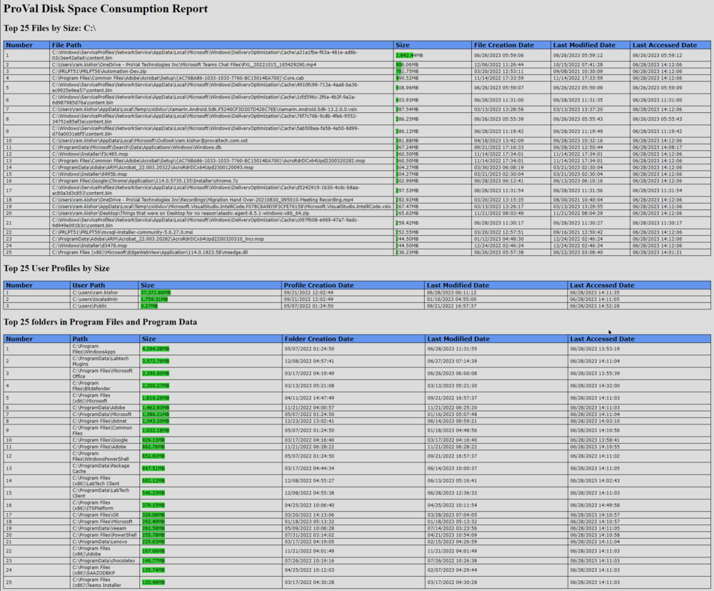

## Summary

the script sends an HTML report of the top 100 files and folders to the user executing the script if the email address(es) is not filled in the user parameter `@Email@`

## Sample Run

## Variables

| Name          | Description                                   |
|---------------|-----------------------------------------------|
| Email         | Email address to send the report to          |
| Drive_Letter  | Drive to generate the report for              |

#### Global Parameters

| Name        | Example                                | Required | Description                                     |
|-------------|----------------------------------------|----------|-------------------------------------------------|
| OutputPath  | C:/Temp/DiskSpaceConsumptionReport     | True     | Path to store the HTML report locally            |

#### User Parameters

| Name        | Example                          | Required | Description                                                                                      |
|-------------|----------------------------------|----------|--------------------------------------------------------------------------------------------------|
| Email       | [someone@somewhere.com](mailto:someone@somewhere.com) | False    | If email address is not provided then the script will by default send the report to the user running the script. |
| Drive_Letter| C                                | False    | If the drive letter is not specified then the script will by default generate the report for C Drive. |

## Output

- Email

## Sample Email

## Sample Report

