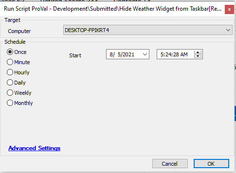

## Summary

This script will insert a registry key to hide the weather widget from the taskbar. The new weather widget was initially rolled out to 21H1 but Microsoft has been pushing it through cumulative updates on supported versions.

**Time Saved by Automation:** 10 Minutes

## Sample Run

## Variables

`@Result@` - This variable will show whether the registry key addition was successfully added or not.

## Process

- Runs PowerShell to insert a registry key that will hide the Weather widget on the Windows taskbar and verifies whether the registry key was successfully added or not.
- If the registry key was successfully added then the script will run the `@Flag for Reboot` script that will flag the machine for a reboot.

## Output

- Script log

