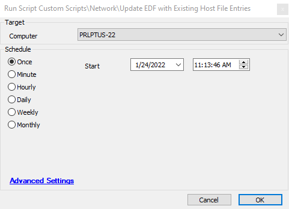

## Summary

This script runs a PowerShell command to pull any custom entries that exist in the computer's host file. If there are custom entries, the Host File Data EDF gets updated with the information separated by commas. If there are no custom entries, it updates the EDF with 'No Custom Entries.'

## Sample Run

This script can be run on a single agent or scheduled on a batch of computers on a recurring basis to keep data in Automate up to date. There are no variables needed for this script.

## Process

1. Run a PowerShell command to return all custom results inside the Windows host file, separated by commas.
2. Update the Host File Contents EDF under Host File Info.

## Output

This script outputs information into the Host File Contents EDF and can be displayed in a Dataview for monitoring if desired.

