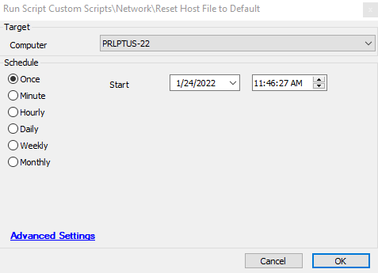

## Summary

This script simply renames the current host file to have OLD in the name and replaces it with a stock host file with no custom entries in it.

## Sample Run

## Dependencies

This script is dependent on the following items:
- [Update EDF with Existing Host File Entries](<./Hosts File - Audit.md>)
- Host File Contents (Extra Data Field)

## Process

1. Rename existing host file to have OLD in the name
2. Build a new host file with the default host file information inside.
3. Perform a `ipconfig /flushdns`
4. Update the Host File Contents EDF with the new info.

## Output

This script outputs information to the following areas:
- Script Log
- Host File Contents EDF
  - 

